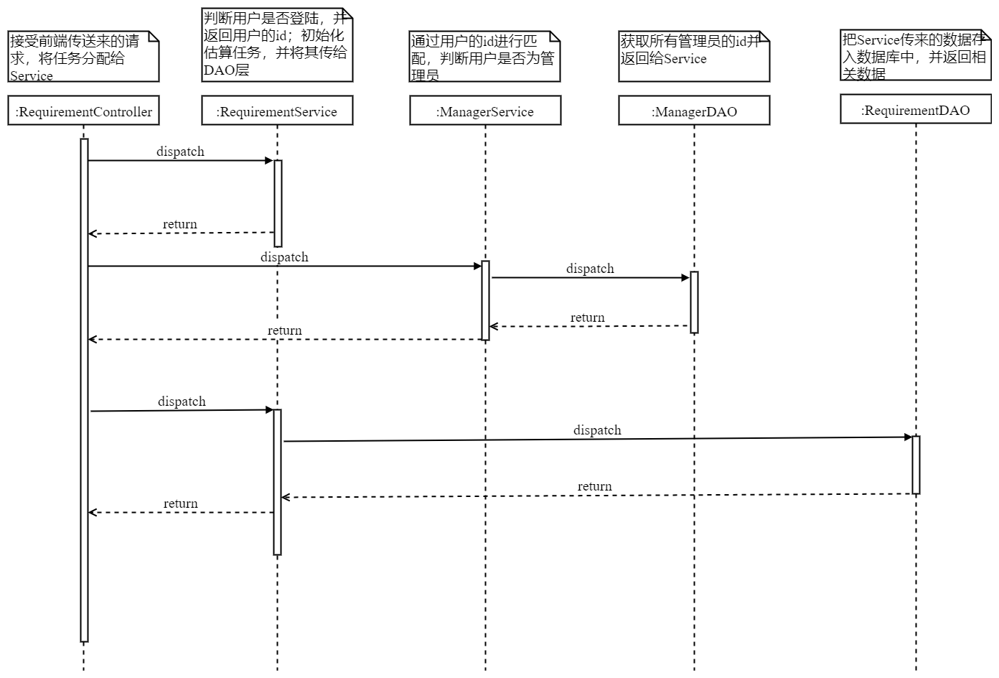
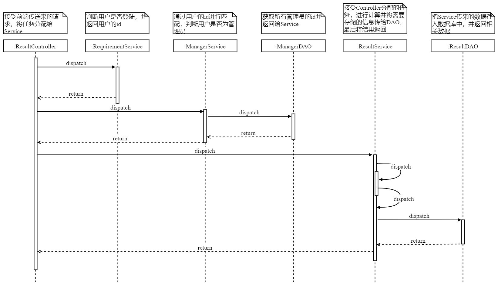
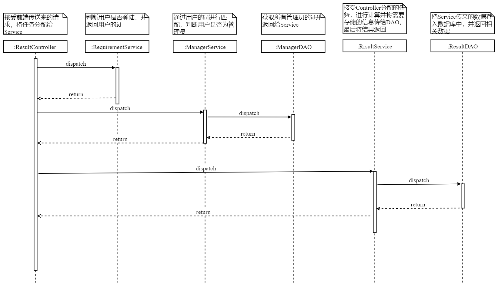
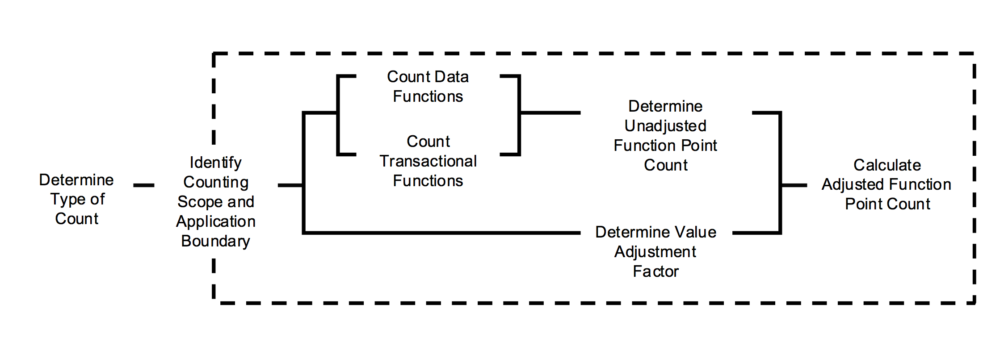
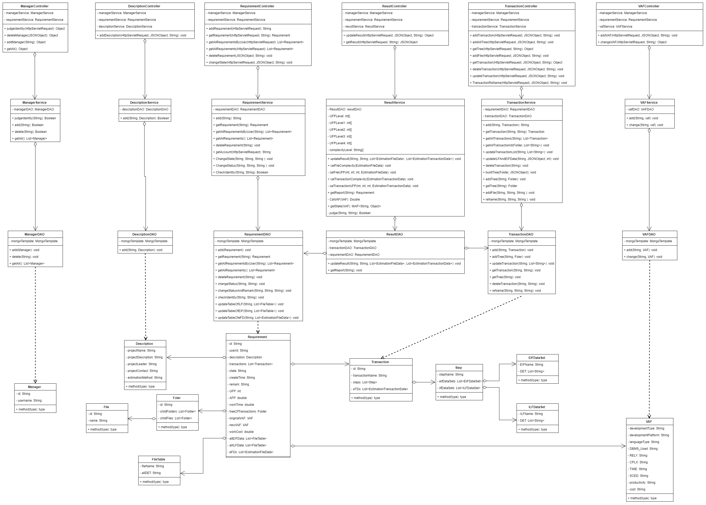

# Detailed Design

## Process Flow Design

The sequence diagram is to show the whole process of the system from the entry point to the end point, for each user scenario. Here are our sequence diagrams: 

### Create Estimate Task

When a user sends a request to create an estimate task through the front-end interface, the backend controller first determines whether it is logged in, and when it is determined that it is logged on, it further determines whether it is an administrator. 

When confirming that the sending request is a regular user, controller assigns the task to the corresponding method in the service, and the service will use the method of the DAO class  to deposit it in the database after completing the initialization of the estimate task, and return the ID of the estimate task.

### Add Project Description 

When a user sends a request to add a project description through the front-end interface, the backend controller first determines whether it is logged in, and when it is determined that it is logged in, it is further judged as an administrator. 

When confirming that the request is sent to a regular user, controller will assign the task to the corresponding method in the service, and the service will, after parsing the JSON data sent by the front end, store it in the database using the DAO method.

### Functional decomposition

When a user sends a request to add a function decomposition through the front-end interface, the backend controller first determines whether it is logged in, and when it is determined that it has landed, it is further judged as an administrator. 

When confirming that the request is sent to a regular user, controller will assign the task to the corresponding method in the service, and the service will, after parsing the JSON data sent by the front end, store it in the database using the DAO method.

### Add Adjustment factor

When a user sends a request to add an adjustment factor through the front-end interface, the backend controller first determines whether it is logged in, and when it is determined that it has landed, it is further judged as an administrator. 

When confirming that a regular user is sending the request, controller assigns the task to the service to add the adjustment factor, and the service will use the DAO method to deposit it in the database after parsing the JSON data sent by the front-end.

###Update Estimate Data

When a user sends a request to update the estimated data through the front-end interface, the backend controller first determines whether it is logged in, and when it is determined that it has landed, it is further judged as an administrator. 

When the administrator is confirmed to send the request, controller assigns the task to the service to update the method of estimating the data, and the service will after parsing the JSON data sent by the front-end and using the IFPUG algorithm, The method of DAO is used to update the estimate data and store it in the database.

### Get Estimation Report

When a user sends a request to obtain an estimate report through the front-end interface, the backend controller first determines whether it is logged in, and when it is determined that it has landed, it is further judged as an administrator.

 When the administrator is confirmed to send the request, controller assigns the task to the service to obtain the estimate report, and the service borrows the DAO method to obtain the corresponding estimate report and returns it to the controller. Finally, Controller will send the retrieved data back to the front.

## Algorithm Design

We use IFPUG Function Point Analysis Algorithm 

### Background

Function point analysis is a scale estimation method based on system function in the phase of requirement analysis, which is based on the indirect scale measurement of external, internal and software performance of the application software.

### algorithm framework (flowchart of pseudocde)

### Key Steps

1. **Determine Type of Count**

Point analysis method defines three function point counting types: New development project function point count, enhancement item function point count, application system function point count. 

2. **Identify Counting Scope and Application Boundary**

The boundaries of the project define the boundaries between the calculated system and the external system and the user.
The boundaries between systems should be defined as far as possible from the perspective of business functions. The counting range defines all functions that will be computed as a function point, and its delineation is determined by the type that performs the function point count.

3. **Count Data Functions**

Data function satisfies the functional user requirements for storing and referencing data. When counting data function, the data is divided into a logical file according to the logical relationship between the data, and the complexity of each logical file is determined.

IFPUG divides data functionality into two categories: internal logical files (ILF) and external interface files (EIF). The complexity of the data functionality is determined by the number of data element types (DET) and record element types (RET).

4. **Count Transactional Functions**

The transaction function represents the function that is used to process data provided to the user. When counting the transaction function, first identify the minimum activity unit that is meaningful to the user and can maintain business continuity as the basic process, and then differentiate it from external input (EI), external output (EO), or external query (EQ), and finally determines the complexity of transaction functionality by referencing the number of file types and data element types.The complexity of transactional functionality is determined by the number of Det and file Type Reference (FTR).

5. **Determine Unadjusted Function Point Count**

UFP=DFP+TFP

TFP=EI+EO+EQ

DFP=ILF+EIF

6. **Determine Value Adjustment Factor**

Value Adjustment Factor introduced.

VAF=(TDI*0.01)+0.65

7. **Calculate Adjusted Function Point Count**

Feature points are usually multiplied by UFP and VAF.

FP=UFP*VAF

New development:

FP=(UFP+CFP)*VAF

Enhancement:

FP=(ADD+CHGA+CPA)*VAFA+(DEL+VAFB)

Re-development:

FP=[(UFPB+ADD+CHGA)-(CHGB+DEL)]*VAFA

## Class Design

Here is the total class diagram of our project.

Our class is divided into four levels, the bottom is an entity class, the second layer is the data access classes, and the third layer is the business logic classes, the top layer is the controller class.

---

### Description

*estimation.bean*

The Description instance in the system. It contains the information about the project.

#### Fields

| Modifier and Type | Field              | Description                        |
| :---------------- | :----------------- | :--------------------------------- |
| *private String*  | projectName        | The name of the project            |
| *private String*  | projectDescription | The description of the project     |
| *private String*  | projectLeader      | The lead of the project            |
| *private String*  | projectContact     | The way of contact with the leader |
| *private String*  | estimationMethod   | The method of the estimation       |

------

### EIFDataSet

*estimation.bean*

The EIFDataSet instance in the system. It contains the data about external interface file.

#### Fields

| Modifier and Type      | Field                     | Description        |
| :--------------------- | :------------------------ | :----------------- |
| *private String*       | ExternalInterfaceFileName | The name of file   |
| *private List<String>* | DET                       | Data Element Types |

#### Methods

> getExternalInterfaceFileName

- *public String getExternalInterfaceFileName()*

Get External Interface File name.

**returns**

External Interface File name

**parameters**

none

> setExternalInterfaceFileName

- *public void setExternalInterfaceFileName(String externalInterfaceFileName)*

Set the External Interface File name.

**returns**

void

**parameters**

-externalInterfaceFileName: file's name

> getDET

- *public List<String> getDET()*

Get Data Element Types.

**returns**

Data Element Types

**parameters**

none

> setDET

- *public void setDET(List<String> dET)*

Set the Data Element Types.

**returns**

void

**parameters**

-dET: Data Element Types list

------

### EstimationFileData

*estimation.bean*

The estimation file instance in the system. It contains the information in the report about data function table.

#### Fields

| Modifier and Type | Field      | Description                  |
| :---------------- | :--------- | :--------------------------- |
| *private String*  | name       | The name of the project      |
| *private String*  | FileType   | The type of the file         |
| *private String*  | RET        | Record Element Types         |
| *private String*  | DET        | Data Element Types           |
| *private int*     | RETNum     | The number of RET            |
| *private int*     | DETNum     | The number of DET            |
| *private String*  | Complexity | The complexity about project |
| *private int*     | UFP        | Unadjusted function points   |

------

### EstimationTransactionData

*estimation.bean*

The estimation file instance in the system. It contains the information in the report about transaction function table.

#### Fields

| Modifier and Type | Field           | Description                  |
| :---------------- | :-------------- | :--------------------------- |
| *private String*  | name            | The name of the project      |
| *private String*  | TransactionType | The type of the file         |
| *private String*  | LogicalFile     | ILF and EIF                  |
| *private String*  | DET             | Data Element Types           |
| *private int*     | FileNum         | The number of file           |
| *private int*     | DETNum          | The number of DET            |
| *private String*  | Complexity      | The complexity about project |
| *private int*     | UFP             | Unadjusted function points   |

------

### File

*estimation.bean*

The File instance in the system. 

#### Fields

| Modifier and Type | Field | Description      |
| :---------------- | :---- | :--------------- |
| *private String*  | name  | The name of file |
| *private String*  | id    | The id of file   |

#### Methods

> getName

- *public String getName()*

Get File name.

**returns**

File name

**parameters**

none

> setName

- *public void setName(String name)*

Set the File name.

**returns**

void

**parameters**

-name: file's name

> getDET

- *public String getId()*

Get file id.

**returns**

File id

**parameters**

none

> setId

- *public void setId(String id)*

Set the file id.

**returns**

void

**parameters**

-id: File's id

------

### FileTable

*estimation.bean*

The Filetable instance in the system. 

#### Fields

| Modifier and Type | Field    | Description            |
| :---------------- | :------- | :--------------------- |
| *private String*  | fileName | The name of file       |
| *private String*  | allDET   | All Data Element Types |

#### Constructors

> FileTable()

Generate the student instance by default value.

**parameters**
none

#### Methods

> setFileName

- *public void setFileName(String fileName)*

Set File name.

**returns**

void

**parameters**

-fileName: file's name

> setAllDET

- *public void setAllDET(String allDET)*

Set all det.

**returns**

void

**parameters**

-allDET: All Data Element Types

------

### Folder

*estimation.bean*

The Folder instance in the system. 

#### Fields

| Modifier and Type      | Field        | Description        |
| :--------------------- | :----------- | :----------------- |
| *private String*       | name         | The name of folder |
| *private String*       | id           | Folder id          |
| *private List<Folder>* | childFolders | the child folders  |
| *private List<File>*   | childFiles   | the child files    |

#### Methods

> getName

- *public String getName()*

Get folder name.

**returns**

folder name

**parameters**

none

> setName

- *public void setName(String name)*

Set folder name.

**returns**

void

**parameters**

name: folder name.

> getId

- *public String getId()*

Get folder id.

**returns**

folder id

**parameters**

none

> setId

- *public void setId(String id)*

Set folder id.

**returns**

void

**parameters**

id: folder id.

> getChildFolders

- *public List<Folder> getChildFolders()*

Get its child folders.

**returns**

child folder lists

**parameters**

none

> setChildFolders

- *public void setChildFolders(List<Folder> childFolders)*

Set child folders.

**returns**

void

**parameters**

childFolders: child folders list.

> getChildFiles

- *public List<File> getChildFiles()*

Get its child files.

**returns**

child file lists

**parameters**

none

> setChildFiles

- *public void setChildFiles(List<Folder> childFiles)*

Set child files.

**returns**

void

**parameters**

childFolders: child files list.

------

### ILFDataSet

*estimation.bean*

The ILFDataSet instance in the system. It contains the data about Inner logical File.

#### Fields

| Modifier and Type      | Field                | Description        |
| :--------------------- | :------------------- | :----------------- |
| *private String*       | InnerlogicalFileName | The name of file   |
| *private List<String>* | DET                  | Data Element Types |

#### Methods

> getInnerlogicalFileNameName

- *public String getInnerlogicFileName()*

Get Inner logical File name.

**returns**

Inner logical File name

**parameters**

none

> setInnerlogicalFileName

- *public void setInnerlogicalFileName(String innerlogicalFileName)*

Set the Inner logical File name.

**returns**

void

**parameters**

-innerlogicalFileName: file's name

> getDET

- *public List<String> getDET()*

Get Data Element Types.

**returns**

Data Element Types

**parameters**

none

> setDET

- *public void setDET(List<String> dET)*

Set the Data Element Types.

**returns**

void

**parameters**

-dET: Data Element Types list

------

### Manager

*estimation.bean*

The Manager instance in the system. 

#### Fields

| Modifier and Type | Field    | Description         |
| :---------------- | :------- | :------------------ |
| *private String*  | id       | The id of manager   |
| *private String*  | username | The name of manager |

#### Methods

> getId

- *public String getId()*

Get manager's id.

**returns**

Manager's id

**parameters**

none

> setId

- *public void setId(String id)*

Set manager's id.

**returns**

void

**parameters**

-id: manager's id

> getUsername

- *public String getUsername()*

Get user name.

**returns**

manager's user name

**parameters**

none

> setUsername

- *public void setUsername(String username)*

Set the user name.

**returns**

void

**parameters**

-username: User's name

------

### Requirement

*estimation.bean*

The Requirement instance in the system. 

#### Fields

| Modifier and Type                | Field               | Description                       |
| :------------------------------- | :------------------ | :-------------------------------- |
| *private String*                 | id                  | The task id                       |
| *private String*                 | userId              | The user id                       |
| *private Description*            | description         | The description of project        |
| private List<Transaction>        | transactions        | transactions list                 |
| private Folder                   | treeOfTransactions  | tree of transactions              |
| private VAF                      | originalVAF         | Original adjustment factor values |
| private VAF                      | newVAF              | New adjustment factor values      |
| private String                   | state               | the task's state                  |
| private String                   | createTime          | the task's create time            |
| private String                   | remark              | the task's remark                 |
| private int                      | UFP                 | Unadjusted function points        |
| private double                   | AFP                 | Adjusted function points          |
| private double                   | workTime            | project's worktime                |
| private double                   | workCost            | project's workcost                |
| private List<FileTable>          | allEIFData          | all external interface file data  |
| private List<FileTable>          | allILFData          | all inner logic file data         |
| private List<EstimationFileData> | estimationFileDatas | EstimationFileData list           |

------

### RET

*estimation.bean*

The RET instance in the system. Record Element Types.

#### Fields

| Modifier and Type | Field    | Description      |
| :---------------- | :------- | :--------------- |
| *private String*  | RETName  | The name of RET  |
| *private String*  | RETField | The field of RET |

------

### Step

*estimation.bean*

The Step instance in the system. 

#### Fields

| Modifier and Type        | Field       | Description        |
| :----------------------- | :---------- | :----------------- |
| *private String*         | stepName    | The name of Step   |
| private List<EIFDataSet> | eifDataSets | The data about EIF |
| private List<ILFDataSet> | ilfDataSets | The data about ILF |

#### Methods

> setStepName

- *public void setStepName(String stepName)*

Set stepName.

**returns**

void

**parameters**

-stepName: step's name

> setEifDataSets

- *public void setEifDataSets(List<EIFDataSet> eifDataSets)*

Set EIF sataSets.

**returns**

void

**parameters**

-eifDataSets: eifDataSets list

> setIlfDataSets

- *public void setIlfDataSets(List<ILFDataSet> ilfDataSets)*

Set ILF sataSets.

**returns**

void

**parameters**

-ilfDataSets: ilfDataSets list

------

### VAF

*estimation.service*

the adjustment factor instance of a requirement.

#### Fields

| Modifier and Type | Field               | Description                       |
| :---------------- | :------------------ | :-------------------------------- |
| *private String*  | developmentType     | the developmentType of project    |
| *private String*  | developmentPlatform | the developmentPlatformof project |
| *private String*  | languageType        | the languageType of project       |
| *private String*  | DBMS_Used           | the DBMS_Used of project          |
| *private String*  | RELY                | the RELY of project               |
| *private String*  | CPLX                | the CPLX of project               |
| *private String*  | TIME                | the TIME of project               |
| *private String*  | SCED                | the SCED of project               |
| *private String*  | productivity        | the productivity of project       |
| *private String*  | cost                | the cost of project               |

------

### Transaction

*estimation.service*

A transaction(File) of the function decomposition tree in a requirement.

#### Fields

| Modifier and Type                        | Field                      | Description                              |
| :--------------------------------------- | :------------------------- | :--------------------------------------- |
| *private String*                         | id                         | the id of a task                         |
| *private String*                         | transactionName            | the name of a transcation                |
| *private List<Step>*                     | steps                      | thelist of  steps of transaction         |
| *private List<EstimationTransactionData>* | estimationTransactionDatas | the list of estimation transaction datas |

### DescriptionService

*estimation.service*

The description service in the system.

#### Fields

| Modifier and Type        | Field          | Description                              |
| :----------------------- | :------------- | :--------------------------------------- |
| *private DescriptionDAO* | descriptionDAO | using for the description of the CURD of estimation task  to the database |

#### Constructors

> Student(int id)

Generate the student instance by student's id.

**parameters**
-id: the id of the student

#### Methods

> add

- *public void add(String id, Description description)*

add the description by id

**returns**

void

**parameters**

-id: description id

-description: the description of a estimation task

**throws**

GeneralExpection

> getName

- *public String getName()*
- *public String getName(int type)*

Get the student name.

**returns**

the student name

**parameters**

-type: 0:full name; 1: first name 2: family name

**throws**

GeneralExpection

------

### ManagerService

*estimation.service*

The manager service in the system.

#### Fields

| Modifier and Type | Field      | Description                              |
| :---------------- | :--------- | :--------------------------------------- |
| *ManagerDAO*      | managerDAO | the operation of  the manager to estimate the estimation task |

#### Methods

> judgeIdentity

- public Boolean judgeIdentity(String username)

Judge the user's identity

**returns**

true or false

**parameters**

-username: the name of user

> add

- public Boolean add(String username)

add manager

**returns**

true or false

**parameters**

-username: the name of user

> delete

- public Boolean delete(String username)

delete manager

**returns**

true or false

**parameters**

-username: the name of user

> getAll

- public List<Manager> getAll()

get the list of all managers

**returns**

the list of all managers

**parameters**

none

------

### RequirementService

*estimation.service*

The requirement service in the system.

#### Fields

| Modifier and Type        | Field          | Description                   |
| :----------------------- | :------------- | :---------------------------- |
| *private RequirementDAO* | requirementDAO | data connect about requrement |

#### Methods

> add

- public String add(String userId)

add a estimation task

**returns**

a task id

**parameters**

-userId: the id of user

> getRequirement

- public Requirement getRequirement(String id)

get a requirement of the addition of a estimaion task

**returns**

a requirement instance

**parameters**

-id: the id of task

> getAllRequirementsByUser

- public List<Requirement> getAllRequirementsByUser(String userId)

get the list of all requirements by userId

**returns**

the list of all requirements

**parameters**

-userId: the id of user

> getAllRequirements

- public List<Requirement> getAllRequirements()

get the list of all requirements

**returns**

the list of all managers

**parameters**

none

> deleteRequirement

- public void deleteRequirement(String id)

delete a requirement

**returns**

none

**parameters**

-id: the task id

> changeState

- public void changeState(String id, String state, String remark)

change the state and remark of the estimation task 

**returns**

none

**parameters**

-id: the task id

-state: the state of the estimation task

-remark: the remark of change

> getAccount

- public String getAccount(HttpServletRequest request)

get the id of user from token and judge the login status of user

**returns**

the id of user

**parameters**

-HttpServletRequest request: Front-end request

> changeStatus

- public void changeStatus(String id, String status)

change the status of the estimation task only

**returns**

none

**parameters**

-id:the task id

-status: the status of task

> checkIdentity

- public boolean checkIdentity(String id, String userId)

judge whether the user has the permission

**returns**

none

**parameters**

-id:the task id

-userId: the id of user

------

### ResultService

*estimation.service*

The result service in the system.

#### Fields

| Modifier and Type   | Field                           | Description               |
| :------------------ | :------------------------------ | :------------------------ |
| *private ResultDAO* | resultDAO                       | data connect about result |
| *private int[]*     | UFPLevel1 = {5,7,10}            | UFPLevel1                 |
| *private int[]*     | UFPLevel2 = {7,10,15}           | UFPLevel2                 |
| *private int[]*     | UFPLevel3 = {3,4,6}             | UFPLevel3                 |
| *private int[]*     | UFPLevel4 = {4,5,7}             | UFPLevel4                 |
| *private int[]*     | UFPLevel                        |                           |
| *private String[]*  | complexityLevel = {"低","中","高"} | complexityLevel           |
| *private VAFState*  | vafState = new VAFState()       |                           |

#### Methods

> updateResult

- public Transaction updateResult(String id, String tId, List<EstimationFileData> eFDs, List<EstimationTransactionData> eTDs)

update the result

**returns**

a transaction

**parameters**

-id: task id

-tId: transcation id

-eFDs: a list of estimation file data

-eTDs:a list of estimation transaction data

> calFileComplexity

- public void calFileComplexity(EstimationFileData eFD)

calculate the complexity of file

**returns**

none

**parameters**

-eFD: estimation file data

> calFileUFP

- private void calFileUFP(int level1, int level2, int level3, EstimationFileData eFD)

calculate the UFP level of file

**returns**

none

**parameters**

-level1:UFPLevel1 = {5,7,10}

-level2:UFPLevel2 = {7,10,15}

-level3:UFPLevel3 = {3,4,6}

-eFD: estimation file data

> calTransactionComplexity

- public void calTransactionComplexity(EstimationTransactionData eTD)

calculate the complexity of transaction

**returns**

none

**parameters**

-eTD: estimation transaction data

> calTransactionUTF

- private void calTransactionUTF(int level1, int level2, int level3, EstimationTransactionData eTD)

calculate the UTF level of transaction

**returns**

none

**parameters**

-level1:UTELevel1 

-level2:UTFLevel2 

-level3:UTFPLevel3 

-eTD: estimation transaction data

> getReport

- public Requirement getReport(String id)

get the report of a estimation task

**returns**

a requirement

**parameters**

-id: task id

> CalVAF

- private double CalVAF(VAF vaf)

calculate the VAF 

**returns**

 iVAF 

**parameters**

-vaf:a VAF instance,  adjustment factor values

> getState

- public VAFState getState(Requirement requirement)

get the state of VAF

**returns**

the state of vaf

**parameters**

-requirement:the requirement of a task

> judge

- private boolean judge(String a, String b)

judge the string a and string b

**returns**

true or false

**parameters**

-a:a string

-b:a string

------

### TransactionService

*estimation.service*

The transaction service in the system.

#### Fields

| Modifier and Type        | Field          | Description                   |
| :----------------------- | :------------- | :---------------------------- |
| *private TransactionDAO* | transactionDAO | data connect about result     |
| *private RequirementDAO* | requirementDAO | data connect about requrement |

#### Methods

> add

- public void add(String id, Transaction transaction)

add one transcation

**returns**

none

**parameters**

-id: task id

-transaction: a transcation instance

> deleteArray

- public void deleteArray(String id, String key)

Delete the key as the key array object, which keys will be deleted

**returns**

none

**parameters**

-id: task id

-key: in the name of transaction instance

> getAllTransactions

- public List<Transaction> getAllTransactions(String id)

get all the  transaction information of a requirement

**returns**

a list of transaction of one requirement

**parameters**

-id: task id

> buildTree

- public void buildTree(Folder parent, JSONObject jsonObject)

build the father note of a directory tree

**returns**

none

**parameters**

-parent: father note

-jsonObject:  a jsonObject  instance , include the information of a directory tree

> addTree

- public void addTree(String id, Folder tree)

add a note to a directory tree

**returns**

none

**parameters**

-id: task id

-tree:father note

> addFile

- public void addFile(String id, String name, String tId)

add file to the tree

**returns**

none

**parameters**

-id: task id

-name:file name

-tId: transaction id

> geTransaction

- public Transaction geTransaction(String id, String tId)

get the transaction of a task

**returns**

transaction instance

**parameters**

-id: task id

-tId: transaction id

> deleteTransaction

- public void deleteTransaction(String id, String tId)

delete a transacation of a task

**returns**

none

**parameters**

-id: task id

-tId: transaction id

> reName

- public void reName(String id, String tId, String tName)

rename a transaction

**returns**

none

**parameters**

-id: task id

-tId: transaction id

-tName: transaction name

> updateTransactionList

- public void updateTransactionList(String id, List<String> tIds)

update the transaction list of a task

**returns**

none

**parameters**

-id: task id

-tIds: list of transaction id

> updateILFAndEIFData

- public void updateILFAndEIFData(String id, JSONArray jsonArray, int flag)

update the ILF and EIF data

**returns**

none

**parameters**

-id: task id

-jsonArray:

-flag: to judge ILF or EIF

> updateETDs

- public void updateETDs(String id,String tId, List<EstimationTransactionData> eTDs)

update the list of estimation transaction data

**returns**

none

**parameters**

-id: task id

-tId: transaction id

-eTDs: list of estimation transaction data

------

### VAFService

*estimation.service*

The VAF service in the system.

#### Fields

| Modifier and Type | Field  | Description            |
| :---------------- | :----- | :--------------------- |
| *private VAFDao*  | vafDAO | data connect about VAF |

#### Methods

> add

- *public void add(String id, VAF vaf)*

add a VAF

**returns**

void

**parameters**

-id: task id

-vaf: a VAF instance, value of adjustment factors

> change

- *public void change(String id,VAF vaf)*

adjust the VAF

**returns**

void

**parameters**

-id: task id

-vaf: a VAF instance, value of adjustment factors

------

### VAFState

*estimation.service*

a instance about the state of VAF

#### Fields

| Modifier and Type | Field                    | Description                           |
| :---------------- | :----------------------- | :------------------------------------ |
| *private boolean* | developmentTypeState     | the value of developmentTypeState     |
| *private boolean* | developmentPlatformState | the value of developmentPlatformState |
| *private boolean* | languageTypeState        | the value of languageTypeState        |
| *private boolean* | DBMS_UsedState           | the value of DBMS_UsedState           |
| *private boolean* | RELYState                | the value of RELYState                |
| *private boolean* | CPLXState                | the value of CPLXState                |
| *private boolean* | TIMEState                | the value of TIMEState                |
| *private boolean* | SCEDState                | the value of SCEDState                |
| *private boolean* | productivityState        | the value of productivityState        |
| *private boolean* | costState                | the value of costState                |

#### Methods

> isDevelopmentTypeState

- *public boolean isDevelopmentTypeState()*

Determine whether to choose the development type

**returns**

true or false

**parameters**

none

> setDevelopmentTypeState

- *public void setDevelopmentTypeState(boolean developmentTypeState)*

set the state of DevelopmentType

**returns**

none

**parameters**

-developmentTypeState:whether to choose the development type,true or false

> isDevelopmentPlatformState

- *public boolean isDevelopmentPlatformState()*

Determine whether to choose the DevelopmentPlatform

**returns**

none

**parameters**

none

> setDevelopmentPlatformState

- *public void setDevelopmentPlatformState(boolean developmentPlatformState)*

set the state of  DevelopmentPlatform

**returns**

none

**parameters**

-developmentPlatformState:whether to choose the DevelopmentPlatform,true or false

> isLanguageTypeState()

- public boolean isLanguageTypeState()

Determine whether to choose the LanguageType

**returns**

true or false

**parameters**

none

> setLanguageTypeState

- *public void setLanguageTypeState(boolean languageTypeState)*

set the state of  LanguageType

**returns**

none

**parameters**

-languageTypeState: whether to choose the LanguageType ,true or false

> isDBMS_UsedState()

- public boolean isDBMS_UsedState()

Determine whether to choose the DBMS_Used

**returns**

true or false

**parameters**

none

> setDBMS_UsedState

- *public void setDBMS_UsedState(boolean dBMS_UsedState)*

set the state of  DBMS_Used

**returns**

none

**parameters**

-dBMS_UsedState: whether to choose theDBMS_Used ,true or false

> isRELYState()

- public boolean isRELYState()

Determine whether to choose the RELY

**returns**

true or false

**parameters**

none

> setRELYState

- *public void setRELYState(boolean rELYState)*

set the state of RELY

**returns**

none

**parameters**

-rELYState: whether to choose the RELY ,true or false

> isTIMEState()

- public boolean isTIMEState()

Determine whether to choose the TIME

**returns**

true or false

**parameters**

none

> setTIMEState

- public void setTIMEState(boolean TIMEState)

set the state of TIME

**returns**

none

**parameters**

-TIMEState: whether to choose the TIME ,true or false\

> setSCEDState

- public void setSCEDState(boolean sCEDState)

set the state of SCED

**returns**

none

**parameters**

-sCEDState: whether to choose the SCED ,true or false

> setProductivityState

- public void setProductivityState(boolean productivityState)

set the state of Productivity

**returns**

none

**parameters**

-productivityState: whether to choose the Productivity ,true or false

> setCostState

- public void setCostState(boolean costState)

set the state of Cost

**returns**

none

**parameters**

-costState: whether to choose the  Cost ,true or false

------

### DescriptionController

*estimation.controller*

Connect with front-end about description.

#### Fields

| Modifier and Type            | Field              | Description                   |
| :--------------------------- | :----------------- | :---------------------------- |
| *private DescriptionService* | descriptionService | business logic in description |
| *private RequirementService* | requirementService | business logic in requirement |

#### Methods

> add

- *public void addDescription(HttpServletRequest request, @RequestBody JSONObject jsonObject, @PathVariable String id)*

Add the Description.

**returns**

void

**parameters**

-request: HttpServletRequest, to get user id.

-jsonObject:  it contains description

-id: task's id

------

### ManagerController

*estimation.controller*

Connect with front-end about manager.

#### Fields

| Modifier and Type          | Field              | Description                   |
| :------------------------- | :----------------- | :---------------------------- |
| *private ManagerService*   | managerService     | business logic in manager     |
| private RequirementService | requirementService | business logic in requirement |

#### Methods

> judgeIdentity

- *public Object judgeIdentity(HttpServletRequest request)*

Judge the user identity.

**returns**

Judging result

**parameters**

-request: HttpServletRequest, to get user name.

> addManager

- *public Object addManager(@RequestBody JSONObject jsonObject)*

Add the manager.

**returns**

Adding result

**parameters**

-jsonObject: it contains manager's username.

> deleteManager

- *public Object deleteManager(@RequestBody JSONObject jsonObject)*

Delete the manager.

**returns**

Deleting result

**parameters**

-jsonObject: it contains manager's username.

> getAll

- *public Object getAll()*

Get all the managers.

**returns**

Getting result

**parameters**

none

------

### RequirementController

*estimation.controller*

Connect with front-end about requirement.

#### Fields

| Modifier and Type          | Field              | Description                   |
| :------------------------- | :----------------- | :---------------------------- |
| *private ManagerService*   | managerService     | business logic in manager     |
| private RequirementService | requirementService | business logic in requirement |

#### Methods

> addRequirement

- *public String addRequirement(HttpServletRequest request)*

Add the requirement.

**returns**

Task Id

**parameters**

-request: HttpServletRequest, to get user id.

> getRequirement

- *public Requirement getRequirement(HttpServletRequest request, @PathVariable String id)*

Get the requirement.

**returns**

a requirement instance

**parameters**

-request: HttpServletRequest, to get user id.

-id: task id

> getAllRequirementsByUser

- *public List<Requirement> getAllRequirementsByUser(HttpServletRequest request)*

Get all requirements by user id.

**returns**

requirement list

**parameters**

-request: HttpServletRequest, to get user id.

> getAllRequirements

- *public List<Requirement> getAllRequirements(HttpServletRequest request)*

Get all requirements.

**returns**

requirement list

**parameters**

-request: HttpServletRequest, to get user id.

> deleteRequirement

- *public void deleteRequirement(HttpServletRequest request, @PathVariable String id)*

Delete the requirement.

**returns**

void

**parameters**

-request: HttpServletRequest, to get user id.

-id: task id

> changeState

- *public void changeState(HttpServletRequest request, @RequestBody JSONObject jsonObject,@PathVariable String id)*

Change the task state

**returns**

void

**parameters**

-request: HttpServletRequest, to get user id.

-jsonObject: it contains "state" and "remark"

-id: task id

------

### ResultController

*estimation.controller*

Connect with front-end about result.

#### Fields

| Modifier and Type            | Field              | Description                   |
| :--------------------------- | :----------------- | :---------------------------- |
| *private ResultService*      | resultService      | business logic in result      |
| *private ManagerService*     | managerService     | business logic in manager     |
| *private RequirementService* | requirementService | business logic in requirement |

#### Methods

> updateResult

- *public Object updateResult(HttpServletRequest request, @RequestBody JSONObject jsonObject, @PathVariable String id)*

Update the result.

**returns**

updating message

**parameters**

-request: HttpServletRequest, to get user id.

-jsonObject:  it contains "eTDs", "eFDs", "tId",

-id: task's id

> getReport

- *public JSONObject getReport(HttpServletRequest request, @PathVariable String id)*

Get the IFPUG report.

**returns**

requirement in json format

**parameters**

-request: HttpServletRequest, to get user id.

-id: task's id

------

### VAFController

*estimation.controller*

Connect with front-end about VAF.

#### Fields

| Modifier and Type            | Field              | Description                   |
| :--------------------------- | :----------------- | :---------------------------- |
| *private VAFService*         | VAFService         | business logic in VAF         |
| *private ManagerService*     | managerService     | business logic in manager     |
| *private RequirementService* | requirementService | business logic in requirement |

#### Methods

> addVAF

- *public void addVAF(HttpServletRequest request, @RequestBody JSONObject jsonObject, @PathVariable String id)*

Add the adjustment factor values.

**returns**

void

**parameters**

-request: HttpServletRequest, to get user id.

-jsonObject:  it contains "developmentType", "developmentPlatform", "languageType", "DBMS_Used", "RELY", "CPLX", "TIME", "SCED", "productivity", "cost".

-id: task's id

> changeVAF

- *public Object changeVAF(HttpServletRequest request, @RequestBody JSONObject jsonObject, @PathVariable String id)*

Update the adjustment factor values.

**returns**

updating message

**parameters**

-request: HttpServletRequest, to get user id.

-jsonObject:  it contains "developmentType", "developmentPlatform", "languageType", "DBMS_Used", "RELY", "CPLX", "TIME", "SCED", "productivity", "cost".

-id: task's id

------

### TransactionController

*estimation.controller*

Connect with front-end about Transaction.

#### Fields

| Modifier and Type            | Field              | Description                   |
| :--------------------------- | :----------------- | :---------------------------- |
| *private TransactionService* | transactionService | business logic in transaction |
| *private ManagerService*     | managerService     | business logic in manager     |
| *private RequirementService* | requirementService | business logic in requirement |

#### Methods

> addTransaction

- *public void addTransaction(HttpServletRequest request, @RequestBody JSONObject jsonObject, @PathVariable String id)*

Add the transaction.

**returns**

void

**parameters**

-request: HttpServletRequest, to get user id.

-jsonObject:  it contains "transactionName", "tId", "steps".

-id: task's id

> addAllTree

- *public void addAllTree(HttpServletRequest request, @RequestBody JSONObject jsonObject, @PathVariable String id)*

Add the all transaction tree.

**returns**

void

**parameters**

-request: HttpServletRequest, to get user id.

-jsonObject:  it contains "tree"

-id: task's id

> getTree

- *public Object getTree(HttpServletRequest request, @PathVariable String id)*

Get the transaction tree.

**returns**

Tree in json format

**parameters**

-request: HttpServletRequest, to get user id.

-id: task's id

> addFile

- *public void addFile(HttpServletRequest request, @RequestBody JSONObject jsonObject, @PathVariable String id)*

Add the file.

**returns**

void

**parameters**

-request: HttpServletRequest, to get user id.

-jsonObject:  it contains "name", "id", "tree"

-id: task's id

> geTransaction

- *public Object geTransaction(HttpServletRequest request, @RequestBody JSONObject jsonObject,@PathVariable String id)*

Get the transaction.

**returns**

transaction information in son format

**parameters**

-request: HttpServletRequest, to get user id.

-jsonObject:  it contains "tId"

-id: task's id

> updateTransaction

- *public void updateTransaction(HttpServletRequest request, @RequestBody JSONObject jsonObject,@PathVariable String id)*

Update the transaction.

**returns**

void

**parameters**

-request: HttpServletRequest, to get user id.

-jsonObject:  it contains "tId", "ILFTable", "EIFTable"

-id: task's id

> deleteTransaction

- *public void deleteTransaction(HttpServletRequest request, @RequestBody JSONObject jsonObject,@PathVariable String id)*

Delete the transaction.

**returns**

void

**parameters**

-request: HttpServletRequest, to get user id.

-jsonObject:  it contains "tId"

-id: task's id

> TransactionReName

- *public void TransactionReName(HttpServletRequest request, @RequestBody JSONObject jsonObject,@PathVariable String id)*

Update the transaction's name.

**returns**

void

**parameters**

-request: HttpServletRequest, to get user id.

-jsonObject:  it contains "tId", "tName"

-id: task's id

------

### DescriptionDAO

*estimation.DAO*

Data connect about description.

#### Fields

| Modifier and Type       | Field         | Description               |
| :---------------------- | :------------ | :------------------------ |
| *private MongoTemplate* | mongoTemplate | mongoDB connect interface |

#### Methods

> add

- *public void add(String id, Description description)*

Add the description by id.

**returns**

void

**parameters**

-id: task id

-description:  project description

------

### ManagerDAO

*estimation.DAO*

Data connect about manager.

#### Fields

| Modifier and Type       | Field         | Description               |
| :---------------------- | :------------ | :------------------------ |
| *private MongoTemplate* | mongoTemplate | mongoDB connect interface |

#### Methods

> add

- *public void add(Manager manager)*

Add manager.

**returns**

void

**parameters**

-manager: a manager instance

> delete

- *public void delete(String username)*

Delete manager.

**returns**

void

**parameters**

-username: manager's name

> getAll

- *public List<Manager> getAll()*

Get all managers.

**returns**

List<Manager>

**parameters**

none

------

### RequirementDAO

*estimation.DAO*

Data connect about requirement.

#### Fields

| Modifier and Type       | Field         | Description               |
| :---------------------- | :------------ | :------------------------ |
| *private MongoTemplate* | mongoTemplate | mongoDB connect interface |

#### Methods

> add

- *public void add(Requirement requirement)*

Add requirement.

**returns**

void

**parameters**

-requirement: a requirement instance

> getRequirement

- *public Requirement getRequirement(String id)*

Get requirement by id.

**returns**

a requirement instance

**parameters**

-id: task id

> getAllRequirementsByUser

- *public List<Requirement> getAllRequirementsByUser(String userId)*

Get all requirements by user ID.

**returns**

List<Requirement>

**parameters**

-userId: user's id

> getAllRequirements

- *public List<Requirement> getAllRequirements()*

Get all requirements.

**returns**

List<Requirement>

**parameters**

none

> deleteRequirement

- *public void deleteRequirement(String id)*

Delete requirement by its name.

**returns**

void

**parameters**

-id:task id

> changeStateAndRemark

- *public void changeStateAndRemark(String id, String state, String remark)*

Update requirement's state and mark by its id.

**returns**

void

**parameters**

-id:task id

-state:requirement's state

-remark:requirement's remark

> changeStatus

- *public void changeStatus(String id, String status)*

Update requirement's state.

**returns**

void

**parameters**

-id:task id

-state:requirement's state

> checkIdentity

- *public boolean checkIdentity(String id, String userId)*

Check user's identity about one requirement.

**returns**

boolean

**parameters**

-id:task id

-userId:user's id

> updateTableOfILF

- *public void updateTableOfILF(String id, List<FileTable> fileTables)*

Update table of ILF.

**returns**

void

**parameters**

-id:task id

-fileTables:data in ILF tables

> updateTableOfEIF

- *public void updateTableOfILF(String id, List<FileTable> fileTables)*

Update table of EIF.

**returns**

void

**parameters**

-id:task id

-fileTables:data in EIF tables

> updateTableOfeFD

- *public void updateTableOfILF(String id, List<FileTable> fileTables)*

Update table of eFD.

**returns**

void

**parameters**

-id:task id

-fileTables:data in eFD tables

------

### ResultDAO

*estimation.DAO*

Data connect about result.

#### Fields

| Modifier and Type        | Field          | Description                    |
| :----------------------- | :------------- | :----------------------------- |
| *private TransactionDAO* | transactionDAO | data connect about transaction |
| *private RequirementDAO* | requirementDAO | data connect about requirement |
| *private MongoTemplate*  | mongoTemplate  | mongoDB connect interface      |

#### Methods

> UpdateResult

- *public Transaction UpdateResult(String id, String tId, List<EstimationFileData> eFDs, List<EstimationTransactionData> eTDs)*

update the result.

**returns**

a Transaction instance

**parameters**

-id: task id

-tId: the transaction instance

-eFDs: estimation file data list

-eTDs: estimation transaction data list

> getReport

- *public Requirement getReport(String id)*

Get the IFPUG report.

**returns**

a requirement instance

**parameters**

-id: task's id

------

### TransactionDAO

*estimation.DAO*

Data connect about transaction(the function of the directory tree).

#### Fields

| Modifier and Type       | Field         | Description               |
| :---------------------- | :------------ | :------------------------ |
| *private MongoTemplate* | mongoTemplate | mongoDB connect interface |

#### Methods

> add

- *public void add(String id, Transaction transaction)*

add one transaction.

**returns**

void

**parameters**

-id: task id

-transaction: a transaction instance

> deleteArray

- *public void deleteArray(String id, String key)*

Delete the Array by task id and key. The array contains some transactions.

**returns**

void

**parameters**

-id: task's id

-key: 

> addTree

- *public void addTree(String id, Folder tree)*

Add the tree of transactions.

**returns**

void

**parameters**

-id: task's id

> updateTransaction

- *public void updateTransaction(String id, List<String> tIds)*

update the transactions by tIds.

**returns**

void

**parameters**

-id: task's id

-tIds: transactions‘ id

> geTransaction

- *public Transaction geTransaction(String id, String tId)*

Get the transactions by tIds.

**returns**

a Transaction instance

**parameters**

-id: task's id

-tId: transaction‘ id

> getTree

- *public Folder getTree(String id)*

Get the transactions trees.

**returns**

a Folder instance

**parameters**

-id: task's id

> deleteTransaction

- *public void deleteTransaction(String id, String tId)*

Delete the transaction by tId.

**returns**

void

**parameters**

-id: task's id

-tId: transaction‘ id

> reName

- *public void reName(String id, String tId, String tName)*

Rename the transaction.

**returns**

void

**parameters**

-id: task's id

-tId: transaction‘ id

-tName: transaction‘ name

> updateETDs

- *public void updateETDs(String id, String tId, List<EstimationTransactionData> eTDs)*

Update the estimation transaction data.

**returns**

void

**parameters**

-id: task's id

-tId: transaction‘ id

-eTDs: estimation transaction data list

------

### VAFDAO

*estimation.DAO*

Data connect about VAF.

#### Fields

| Modifier and Type       | Field         | Description               |
| :---------------------- | :------------ | :------------------------ |
| *private MongoTemplate* | mongoTemplate | mongoDB connect interface |

#### Methods

> add

- *public void add(String id, VAF vaf)*

Add the VAF by id.

**returns**

void

**parameters**

-id: task id

-vaf:  a VAF instance, including all adjustment factor values

> change

- *public void change(String id, VAF vaf)*

Update the VAF by id.

**returns**

void

**parameters**

-id: task id

-vaf:  a VAF instance, including all adjustment factor values

------

### 
