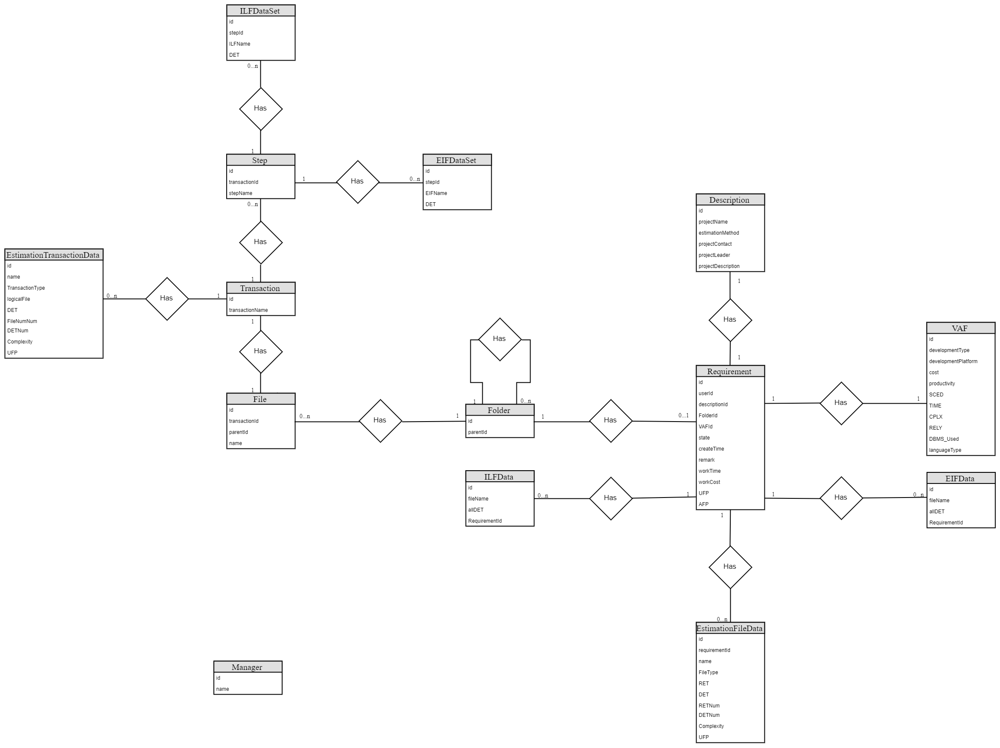

# High-level Design

## Prototype Design

The UI design of the project

### User Section

#### View estimate tasks

This part is for viewing estimate tasks. Here you can see the basic information of all the estimated projects for that user.


You can search for projects based on status, time, etc.


#### Create Estimation-Project description

Fill in the project name, Introduction and other basic project information.


#### Create Estimation-Functional Decomposition

Describe the basic structure of a project.


Fill the ILF and EIF tables. Then write the steps of "login".


Detail each step, choose the ILFs and EIFs, then choose the data fields for each file.


#### Create Estimation-Adjustment Factor

Select adjustment factors for the project.


### Administrator Section

#### View estimate tasks

This part is for viewing estimate tasks. Here you can see the basic information of all the estimated projects for that user.


#### Functional Decomposition

Describe the basic structure of a project.


#### View Adjustment Factor

View adjustment factors for the project.


#### Edit Adjustment Factor

Edit adjustment factors for the project.


### View The Report


## Business Architecture

The business architecture outline the key components in each layers of the project systems. Here is our Business Architecture:


In the view layer,  we have two roles in the system, which can see different pages and have different functions. Because the whole estimation system is a subsystem of the Crowdsourcing System, and the login/logout function is realized by them. What we need to do is just the process of estimation.

The user subsystem is mainly responsible for estimating task creation and modification. The users can first create the estimation task and then finish the details of it. And he can modify the specific information of the estimated task if the error is filled in before. If he think that the project is totally wrong, he can also delete his project. Once the task completing estimation, the user could check the estimation Report of it.

And the manager subsystem is primarily responsible for estimating and generating estimate reports. He can also add remark of the estimation task to inform the user to modify task information.

In the control layer, we need to have different business logic for the user and the administrator, and they will both interact with the database throw the same data access class. And we can see, there is a estimation method named IFPUG in the manager subsystem to help the managers with the software estimate.

In the Model Layer, we need to store the data of all the requirements and the managers. The information of the users is stored by the Crowdsourcing System.

## Technology Architecture

The architecture of the technology stacks (coding language, frameworks, libraries, styles, etc) used in the project. Here is our Technology Architecture:


In the UI Layer, we use Vuejs as our front end frame and build the front end on the Nodejs.

In the Application Layer, we use Java as the primary development language for our backend. At the same time, we use the Spring-boot-starter-data-mongodb to Exchange data with the MongoDB database, and through the Spring-boot-starter-data-redis to obtain the crowdsourcing system cache cookies on the Redis, which records the user's login status.

In the Persistence Layer, we use MongoDB for basic data storage, while using Redis to save cookies that record user login status. Spring-boot automatically caches logs and checks for errors or business records.

## Deployment Topology

Deployment Topology shows how the whole project is deployed in the physical environment, including servers, VMs/containers, networks, key components, etc. An overview picture is required to show the topology. Here is our Deployment Topology:


We use the method of front and rear separation to deploy, at the same time, the back end of our estimation system and the back end of the crowdsourcing system are respectively deployed on two computers, respectively interacting with different databases, but together for the same front-end service. This depends on spring's support for cross-domain access, and the low coupling between the estimate system and the crowdsourcing system.

## Data Models

### Entity-Relation Design

An Entity-Relation Diagram is required to show the concepts in the project and their relations.

Here is our E-R diagram:



#### Relationship

- *Requirement-Folder*

  For each estimate task, it needs to have a function decomposition Tree, so each estimate task must correspond to a top-level folder. But not at the top of the folder does not correspond to an estimate task.

  ​

- *Requirement-Description*

  Each estimate task has a description, and each description must correspond to an estimate task.

  ​

- *Requirement-VAF*

  Each estimate task has a set of adjustment factors, and each group of adjustment factors necessarily corresponds to an estimate task.

  ​

- *Requirement-ILFData*

  Each estimate task has a list of all ILF and corresponding DET information, and each item in the list corresponds to only one estimate task.

  ​

- *Requirement-EIFData*

  Each estimate task has a list of all EIF and corresponding DET information, and each item in the list corresponds to only one estimate task.

  ​

- *Requirement-EstimationFileData*

  Each estimate task has a list that contains all the data features, and each item in the list corresponds to only one estimate task.

  ​

- *Folder-Folder*

  A directory tree is made up of files and folders, and a folder can contain several folders, but there is only one parent node for each folder.

  ​

- *Folder-File*

  A directory tree is made up of files and folders, and a folder can contain several files, but there is only one parent node for each file.

  ​

- *File-Transaction*

  Each file node of the tree corresponds to a function of the project, and each function is relative to a file node in the directory tree.

  ​

- *Transaction-EstimationTransactionData*

  Each feature in the project has a list of its transactional function points, and each item in the list corresponds to only one function.

  ​

- *Transaction-Step*

  Each feature in the project contains several steps, each of which corresponds to only one function.

  ​

- *Step-EIFDataSet*

  Each step in a feature corresponds to a ILF and a list of DETs used, and each item in the list will only correspond to one step.

  ​

- *Step-ILFDataSet*

  Each step in a feature corresponds to a ILF and a list of DETs used, and each item in the list will only correspond to one step.

### Database Design

According to the Entity-Relation Design, the detailed database design for entities and relations should be listed as tables. Here is our tables:

**Table: Requirement**

|    Column     |     Type     | Description                   |
| :-----------: | :----------: | :---------------------------- |
|      id       | varcher[100] | key, identifier               |
|    userId     | varcher[100] | id of the user                |
| descriptionId | varcher[100] | id of the description         |
|   FolderId    | varcher[100] | id of the Folder              |
|     VAFId     | varcher[100] | id of the VAF                 |
|     state     | varcher[100] | the state of Requirement      |
|  createTime   | varcher[100] | the createTime of Requirement |
|    remark     | varcher[100] | the remark of Requirement     |
|   workTime    |   integer    | the workTime of Requirement   |
|   workCost    |   integer    | the workCost of Requirement   |
|      UFP      |   integer    | the UFP of Requirement        |
|      AFP      |   integer    | the AFP of Requirement        |

**Table: Description**

|       Column       |     Type     | Description                          |
| :----------------: | :----------: | :----------------------------------- |
|         id         | varcher[100] | key, identifier                      |
|    projectName     | varcher[100] | name of the project                  |
|  estimationMethod  | varcher[100] | the estimation method of the project |
|   projectContact   | varcher[100] | the contact of the project           |
|   projectLeader    | varcher[100] | the leader of the project            |
| projectDescription | varcher[100] | the description of the project       |

**Table: VAF**

|       Column        |     Type     | Description                              |
| :-----------------: | :----------: | :--------------------------------------- |
|         id          | varcher[100] | key, identifier                          |
|   developmentType   | varcher[100] | the development type of the project      |
| developmentPlatform | varcher[100] | the development platform of the project  |
|        cost         | varcher[100] | monthly salary per person                |
|    productivity     | varcher[100] | average efficiency                       |
|        SCED         | varcher[100] | Development Progress of project requirements |
|        TIME         | varcher[100] | Project Execution time constraints       |
|        CPLX         | varcher[100] | the complexity of the project            |
|        RELY         | varcher[100] | the reliability of the project           |
|      DBMS_Used      | varcher[100] | whether the project needs to use database or not |
|    languageType     | varcher[100] | which language will be used by the project |

**Table: EIFData**

|    Column     |     Type     | Description                         |
| :-----------: | :----------: | :---------------------------------- |
|      id       | varcher[100] | key, identifier                     |
|   fileName    | varcher[100] | the name of the EIF                 |
|    allDET     | varcher[100] | all DETs of the EIF                 |
| requirementId | varcher[100] | id of the corresponding requirement |

**Table: ILFData**

|    Column     |     Type     | Description                         |
| :-----------: | :----------: | :---------------------------------- |
|      id       | varcher[100] | key, identifier                     |
|   fileName    | varcher[100] | the name of the ILF                 |
|    allDET     | varcher[100] | all DETs of the ILF                 |
| requirementId | varcher[100] | id of the corresponding requirement |

**Table: EstimationFileData**

|    Column     |     Type     | Description                         |
| :-----------: | :----------: | :---------------------------------- |
|      id       | varcher[100] | key, identifier                     |
| requirementId | varcher[100] | id of the corresponding requirement |
|     name      | varcher[100] | the name of the file                |
|   FileType    | varcher[100] | the type of the file                |
|      RET      | varcher[100] | all RETs of the file                |
|      DET      | varcher[100] | all DETs of the file                |
|    RETNum     | varcher[100] | the number of RET in the file       |
|    DETNum     | varcher[100] | the number of DET in the file       |
|  complexity   |   integer    | the complexity of the file          |
|      UFP      |   integer    | the UFP of the file                 |

**Table: EstimationTransactionData**

|     Column      |     Type     | Description                           |
| :-------------: | :----------: | :------------------------------------ |
|       id        | varcher[100] | key, identifier                       |
|  requirementId  | varcher[100] | id of the corresponding requirement   |
|      name       | varcher[100] | the name of the transaction           |
| TransactionType | varcher[100] | the type of the transaction           |
|      File       | varcher[100] | all files of the transaction          |
|       DET       | varcher[100] | all DETs of the transaction           |
|     FileNum     | varcher[100] | the number of file in the transaction |
|     DETNum      | varcher[100] | the number of DET in the transaction  |
|   complexity    |   integer    | the complexity of the transaction     |
|       UFP       |   integer    | the UFP of the transaction            |

**Table: Folder**

|  Column  |     Type     | Description             |
| :------: | :----------: | :---------------------- |
|    id    | varcher[100] | key, identifier         |
| parentId | varcher[100] | parent id of the folder |

**Table: Folder**

|    Column     |     Type     | Description                             |
| :-----------: | :----------: | :-------------------------------------- |
|      id       | varcher[100] | key, identifier                         |
|   parentId    | varcher[100] | parent id of the file                   |
| transactionId | varcher[100] | the id of the corresponding transaction |
|     name      | varcher[100] | the name of the file                    |

**Table: Transaction**

|     Column      |     Type     | Description                 |
| :-------------: | :----------: | :-------------------------- |
|       id        | varcher[100] | key, identifier             |
| transactionName | varcher[100] | the name of the transaction |

**Table: Step**

|    Column     |     Type     | Description                         |
| :-----------: | :----------: | :---------------------------------- |
|      id       | varcher[100] | key, identifier                     |
| transactionId | varcher[100] | id of the corresponding transaction |
|   stepName    | varcher[100] | the name of the step                |

**Table: ILFDataSer**

| Column  |     Type     | Description                      |
| :-----: | :----------: | :------------------------------- |
|   id    | varcher[100] | key, identifier                  |
| stepId  | varcher[100] | the id of the corresponding step |
| ILFName | varcher[100] | the name of the ILF              |
|   DET   | varcher[100] | all DETs of the ILF              |

**Table: EIFDataSer**

| Column  |     Type     | Description                      |
| :-----: | :----------: | :------------------------------- |
|   id    | varcher[100] | key, identifier                  |
| stepId  | varcher[100] | the id of the corresponding step |
| EIFName | varcher[100] | the name of the EIF              |
|   DET   | varcher[100] | all DETs of the EIF              |


## Interface Specifications

The specifications of interfaces used in interactions among subsystems.

---
### *estimation/addRequirement*   

#### Description

Add a new requirement(estimation project).

|                |          |
| -------------- | -------- |
| Request Method | Get      |
| Authorization  | Required |


#### Parameters

| Name | Located in | Description | Required | Schema |
| :--: | :--------: | :---------- | :------: | :----- |
| null |    null    | null        |   null   | null   |

#### Headers 

|      Key      | value  |
| :-----------: | :----: |
| Authorization | String |

#### Body 

| Key  | value |
| :--: | :---: |
| void | void  |

#### Responses

| Code | Description         | Schema        |
| :--: | :------------------ | :------------ |
| 200  | Successful response | *id* : string |

#### Request Sample

```
estimation/addRequirement
```

#### Response Sample

```
{

  "_id" : "1515998053438"

}

```
---

### *estimation/getRequirement*

#### Description

Get a requirement(estimation project) by id.

|                |          |
| -------------- | -------- |
| Request Method | Get      |
| Authorization  | Required |

#### Parameters

| Name | Located in | Description                        | Required | Schema |
| :--: | :--------: | :--------------------------------- | :------: | :----- |
|  id  |   query    | requirement(estimation project) id |   Yes    | String |

#### Headers 

|      Key      | value  |
| :-----------: | :----: |
| Authorization | String |

#### Body 

| Key  | value |
| :--: | :---: |
| void | void  |

#### Responses

| Code | Description         | Schema                 |
| :--: | :------------------ | :--------------------- |
| 200  | Successful response | *requirement* : Object |

#### Request Sample

```
estimation/getRequirement?id=1515998053438
```

#### Response Sample

```
{
    requirement:{
      "_id" : "1515998053438",
      "_class" : "estimation.bean.Requirement",
      "userId" : "admin",
      "description" : {
          "projectName" : "admin的项目",
          "projectDescription" : "admin的项目",
          "projectLeader" : "admin",
          "projectContact" : "192837192837",
          "estimationMethod" : "IFPUG"
      },
      "transactions" : [ 
          {
              "_id" : "1515998086763",
              "transactionName" : "lskdjf",
              "steps" : [ 
                  {
                      "stepName" : "sad ",
                      "eifDataSets" : [ 
                          {
                              "ExternalInterfaceFileName" : "qwe ",
                              "DET" : [ 
                                  "qw"
                              ]
                          }
                      ],
                      "ilfDataSets" : [ 
                          {
                              "InnerlogicalFileName" : "sd",
                              "DET" : [ 
                                  "d"
                              ]
                          }
                      ]
                  }
              ],
              "estimationTransactionDatas" : [ 
                  {
                      "name" : "asd ",
                      "TransactionType" : "EI",
                      "LogicalFile" : " as a as as a ",
                      "DET" : "asd ad asdasd ",
                      "FileNum" : 5,
                      "DETNum" : 3,
                      "Complexity" : "低",
                      "UFP" : 3
                  }
              ]
          }
      ],
      "treeOfTransactions" : {
          "_id" : "1515998074311",
          "name" : "tree",
          "childFolders" : [ 
              {
                  "_id" : "00001",
                  "name" : "功能模块1",
                  "childFolders" : [],
                  "childFiles" : [ 
                      {
                          "_id" : "1515998086763",
                          "name" : "lskdjf"
                      }
                  ]
              }
          ],
          "childFiles" : []
      },
      "state" : "完成",
      "createTime" : "2018-01-15T14:34:13.516",
      "remark" : "",
      "UFP" : 0,
      "AFP" : 0.0,
      "workTime" : 0.0,
      "workCost" : 0.0,
      "allEIFData" : [ 
          {
              "fileName" : "qwe ",
              "allDET" : "qw  qwe"
          }
      ],
      "allILFData" : [ 
          {
              "fileName" : "sd",
              "allDET" : "sd d"
          }
      ],
      "estimationFileDatas" : [ 
          {
              "name" : "dfs dfs",
              "FileType" : "ILF",
              "RET" : "dfds",
              "DET" : "df df dfs",
              "RETNum" : 1,
              "DETNum" : 3,
              "Complexity" : "低",
              "UFP" : 5
          }
      ],
      "originalVAF" : {
          "developmentType" : "New Development",
          "developmentPlatform" : "Mainframe",
          "languageType" : "4GL",
          "DBMS_Used" : "No",
          "RELY" : "Low",
          "CPLX" : "Very High",
          "TIME" : "Very High",
          "SCED" : "Low",
          "productivity" : "12",
          "cost" : "123"
      },
      "newVAF" : {
          "developmentType" : "New Development",
          "developmentPlatform" : "Mainframe",
          "languageType" : "4GL",
          "DBMS_Used" : "No",
          "RELY" : "Low",
          "CPLX" : "Very High",
          "TIME" : "Very High",
          "SCED" : "Low",
          "productivity" : "12",
          "cost" : "123"
      }
    }
}
```

------

### *estimation/getAllRequirementsByUser*

#### Description

Get basic information about all the requirements of a user by user's id.

|                |          |
| -------------- | -------- |
| Request Method | Get      |
| Authorization  | Required |

#### Parameters 

| Name | Located in | Description | Required | Schema |
| :--: | :--------: | :---------- | :------: | :----- |
| null |    null    | null        |   null   | null   |

#### Headers 

|      Key      | value  |
| :-----------: | :----: |
| Authorization | String |

#### Body 

| Key  | value |
| :--: | :---: |
| void | void  |

#### Responses 

| Code | Description         | Schema                       |
| :--: | :------------------ | :--------------------------- |
| 200  | Successful response | *requiements* : List<Object> |

#### Request Sample 

```
estimation/getAllRequirementsByUser
```

#### Response Sample 

```
{
    requirements: [{
      "_id" : "1515998053438",
      "_class" : "estimation.bean.Requirement",
      "userId" : "admin",
      "description" : {
          "projectName" : "admin的项目",
          "projectDescription" : "admin的项目",
          "projectLeader" : "admin",
          "projectContact" : "192837192837",
          "estimationMethod" : "IFPUG"
        }
    },{
      "_id" : "1516007668493",
      "_class" : "estimation.bean.Requirement",
      "userId" : "admin",
      "description" : {
          "projectName" : "校园信息管理系统",
          "projectDescription" : "同济大学",
          "projectLeader" : "刘家琪",
          "projectContact" : "15666666666",
          "estimationMethod" : "IFPUG"
        }
    }]
}

```

------

### *estimation/getAllRequirements*

#### Description

Get basic information about all the requirements of all users. 

Note: Only administrators can call this interface.

|                |          |
| -------------- | -------- |
| Request Method | Get      |
| Authorization  | Required |

#### Parameters

| Name | Located in | Description | Required | Schema |
| :--: | :--------: | :---------- | :------: | :----- |
| null |    null    | null        |   null   | null   |

#### Headers 

|      Key      | value  |
| :-----------: | :----: |
| Authorization | String |

#### Body 

| Key  | value |
| :--: | :---: |
| void | void  |

#### Responses

| Code | Description         | Schema               |
| :--: | :------------------ | :------------------- |
| 200  | Successful response | *requiements* : List |

#### Request Sample

```
estimation/getAllRequirements
```

#### Response Sample

```
{
    requirements: [{
      "_id" : "1515998053438",
      "_class" : "estimation.bean.Requirement",
      "userId" : "admin",
      "description" : {
          "projectName" : "admin的项目",
          "projectDescription" : "admin的项目",
          "projectLeader" : "admin",
          "projectContact" : "192837192837",
          "estimationMethod" : "IFPUG"
        }
    },{
      "_id" : "1516007668493",
      "_class" : "estimation.bean.Requirement",
      "userId" : "admin",
      "description" : {
          "projectName" : "校园信息管理系统",
          "projectDescription" : "同济大学",
          "projectLeader" : "刘家琪",
          "projectContact" : "15666666666",
          "estimationMethod" : "IFPUG"
        }
    }]
}
```

------

### *estimation/deleteRequirement*

#### Description

Delete a requirement by id. 

Note: Only owner of the requirement could delete his requirement.

|                |          |
| -------------- | -------- |
| Request Method | Post     |
| Authorization  | Required |

#### Parameters 

| Name | Located in | Description    | Required | Schema |
| :--: | :--------: | :------------- | :------: | :----- |
|  id  |   query    | requirement id |   yes    | String |

#### Headers 

|      Key      | value  |
| :-----------: | :----: |
| Authorization | String |

#### Body 

| Key  | value |
| :--: | :---: |
| void | void  |

#### Responses

| Code | Description         | Schema |
| :--: | :------------------ | :----- |
| 200  | Successful response | void   |

#### Request Sample

```
estimation/deleteRequirement?id=1516007668493
```

#### Response Sample

```
{}
```

------

### *estimation/changeState*

#### Description 

change the state and remark of a requirement. 

Note: Only administrators can call this interface.

|                |          |
| -------------- | -------- |
| Request Method | Post     |
| Authorization  | Required |

#### Parameters 

| Name | Located in | Description    | Required | Schema |
| :--: | :--------: | :------------- | :------: | :----- |
|  id  |   query    | requirement id |   yes    | String |

#### Headers 

|      Key      | value  |
| :-----------: | :----: |
| Authorization | String |

#### Body 

| Key  | value |
| :--: | :---: |
| void | void  |

#### Responses 

| Code | Description         | Schema |
| :--: | :------------------ | :----- |
| 200  | Successful response | void   |

#### Request Sample 

```
estimation/changeState?id=1516007668493
```

#### Response Sample 

```
{}
```

------

### *estimation/addDescription*

#### Description 

Add or change the description of a requirement. 

Note: Only owner of the requirement could add the description of his requirement.

|                |          |
| -------------- | -------- |
| Request Method | Get      |
| Authorization  | Required |

#### Parameters 

| Name | Located in | Description    | Required | Schema |
| :--: | :--------: | :------------- | :------: | :----- |
|  id  |   query    | requirement id |   yes    | String |

#### Headers 

|      Key      | value  |
| :-----------: | :----: |
| Authorization | String |

#### Body 

|        Key         | value  |
| :----------------: | :----: |
|    projectName     | String |
| projectDescription | String |
|   projectLeader    | String |
|   projectContact   | String |
|  estimationMethod  | String |

#### Responses 

| Code | Description         | Schema |
| :--: | :------------------ | :----- |
| 200  | Successful response | void   |

#### Request Sample 

```
estimation/addDescription?id=1516007668493
```

#### Response Sample 

```
{}
```

------

### *estimation/identity*

#### Description

Check if the logged in user is an administrator. 

|                |          |
| -------------- | -------- |
| Request Method | Get      |
| Authorization  | Required |

#### Parameters

| Name | Located in | Description | Required | Schema |
| :--: | :--------: | :---------- | :------: | :----- |
| null |    null    | null        |   null   | null   |

#### Headers 

|      Key      | value  |
| :-----------: | :----: |
| Authorization | String |

#### Body 

| Key  | value |
| :--: | :---: |
| null | null  |

#### Responses

| Code | Description         | Schema      |
| :--: | :------------------ | :---------- |
| 200  | Successful response | *code*: int |

#### Request Sample

```
estimation/identity
```

#### Response Sample 

```
{
  "code" : 0    //0 represents the administrator, 1 represents the normal user, 200 is not logged in, and 500 represents database error
}
```

------

### *estimation/add*

#### Description

Add the manager authority of a user. 

Note: Only administrators can call this interface.

|                |          |
| -------------- | -------- |
| Request Method | Post     |
| Authorization  | Required |

#### Parameters

| Name | Located in | Description | Required | Schema |
| :--: | :--------: | :---------- | :------: | :----- |
| null |    null    | null        |   null   | null   |

#### Headers 

|      Key      | value  |
| :-----------: | :----: |
| Authorization | String |

#### Body 

|   Key    | value  |
| :------: | :----: |
| username | String |

#### Responses

| Code | Description         | Schema       |
| :--: | :------------------ | :----------- |
| 200  | Successful response | *code* : Int |

#### Request Sample

```
estimation/add
```

#### Response Sample

```
{
  "code" : 0   //0 represents success, 200 represents failure, and 500 represents database error
}
```

------

### *estimation/delete*

#### Description 

Remove administrator authority for a user. 

Note: Only administrators can call this interface.

|                |          |
| -------------- | -------- |
| Request Method | Post     |
| Authorization  | Required |

#### Parameters

| Name | Located in | Description | Required | Schema |
| :--: | :--------: | :---------- | :------: | :----- |
| null |    null    | null        |   null   | null   |

#### Headers 

|      Key      | value  |
| :-----------: | :----: |
| Authorization | String |

#### Body 

|   Key    | value  |
| :------: | :----: |
| username | String |

#### Responses

| Code | Description         | Schema       |
| :--: | :------------------ | :----------- |
| 200  | Successful response | *code* : Int |

#### Request Sample

```
estimation/delete
```

#### Response Sample

```
{
  "code" : 0     //0 represents successful, 200 represents failure, and 500 represents database error
}
```

------

### *estimation/delete*

#### Description 

get the usernames of all administrators. 

Note: Only administrators can call this interface.

|                |          |
| -------------- | -------- |
| Request Method | Post     |
| Authorization  | Required |

#### Parameters

| Name | Located in | Description | Required | Schema |
| :--: | :--------: | :---------- | :------: | :----- |
| null |    null    | null        |   null   | null   |

#### Headers 

|      Key      | value  |
| :-----------: | :----: |
| Authorization | String |

#### Body 

|   Key    | value  |
| :------: | :----: |
| username | String |

#### Responses

| Code | Description         | Schema                |
| :--: | :------------------ | :-------------------- |
| 200  | Successful response | *list* : List<String> |

#### Request Sample

```
estimation/getAll
```

#### Response Sample

```
{
  "list" : ["sixaps","admin"]
}
```

------

### *estimation/updateResult*

#### Description 

Update estimated transaction information and data information, and calculate their complexity and UFP . 

Note: Only administrators can call this interface.

|                |          |
| -------------- | -------- |
| Request Method | Get      |
| Authorization  | Required |

#### Parameters

| Name | Located in | Description    | Required | Schema |
| :--: | :--------: | :------------- | :------: | :----- |
|  id  |   query    | requirement id |   yes    | String |

#### Headers 

|      Key      | value  |
| :-----------: | :----: |
| Authorization | String |

#### Body 

| Key  |   value   |
| :--: | :-------: |
| eTDs | JSONArray |
| eFDs | JSONArray |
| tId  |  String   |

#### Responses

| Code | Description         | Schema                         |
| :--: | :------------------ | :----------------------------- |
| 200  | Successful response | *result* : Map<String, Object> |

#### uest Sample

```json
url:"http://ip:8011/estimation/updateResult?id=1515998053438"
body:{
  "eTDs" : [ {
                    "name" : "asd ",
                    "transactionType" : "EI",
                    "logicalFile" : " as a as as a ",
                    "DET" : "asd ad asdasd ",
                    "FileNum" : 5,
                    "detNum" : 3
              }
 ],
 "eFDs" : [ 
        {
            "name" : "dfs dfs",
            "FileType" : "ILF",
            "RET" : "dfds",
            "DET" : "df df dfs",
            "RETNum" : 1,
            "DETNum" : 3
        }
    ],
  "tId" : "1515998086763"
}
```

#### Response Sample

```
{
  "estimationTransactionDatas" : [ 
                {
                    "name" : "asd ",
                    "TransactionType" : "EI",
                    "LogicalFile" : " as a as as a ",
                    "DET" : "asd ad asdasd ",
                    "FileNum" : 5,
                    "DETNum" : 3,
                    "Complexity" : "低",
                    "UFP" : 3
                }
            ],
  "estimationFileDatas" : [ 
        {
            "name" : "dfs dfs",
            "FileType" : "ILF",
            "RET" : "dfds",
            "DET" : "df df dfs",
            "RETNum" : 1,
            "DETNum" : 3,
            "Complexity" : "低",
            "UFP" : 5
        }
    ]
}
```

------

### *estimation/getReport*

#### Description 

Get the estimation report of a requirement. 

|                |          |
| -------------- | -------- |
| Request Method | Get      |
| Authorization  | Required |

#### Parameters 

| Name | Located in | Description | Required | Schema |
| :--: | :--------: | :---------- | :------: | :----- |
|  id  |   query    | requirement |   yes    | String |

#### Headers 

|      Key      | value  |
| :-----------: | :----: |
| Authorization | String |

#### Body 

| Key  | value |
| :--: | :---: |
| void | void  |

#### Responses

| Code | Description         | Schema                |
| :--: | :------------------ | :-------------------- |
| 200  | Successful response | *requiement* : Object |

#### Request Sample

```
estimation/getReport?id=1515998053438
```

#### Response Sample

```json
{
    "_id" : "1515998053438",
    "_class" : "estimation.bean.Requirement",
    "userId" : "admin",
    "description" : {
        "projectName" : "admin的项目",
        "projectDescription" : "admin的项目",
        "projectLeader" : "admin",
        "projectContact" : "192837192837",
        "estimationMethod" : "IFPUG"
    },
    "transactions" : [ 
        {
            "_id" : "1515998086763",
            "transactionName" : "lskdjf",
            "steps" : [ 
                {
                    "stepName" : "sad ",
                    "eifDataSets" : [ 
                        {
                            "ExternalInterfaceFileName" : "qwe ",
                            "DET" : [ 
                                "qw"
                            ]
                        }
                    ],
                    "ilfDataSets" : [ 
                        {
                            "InnerlogicalFileName" : "sd",
                            "DET" : [ 
                                "d"
                            ]
                        }
                    ]
                }
            ],
            "estimationTransactionDatas" : [ 
                {
                    "name" : "asd ",
                    "TransactionType" : "EI",
                    "LogicalFile" : " as a as as a ",
                    "DET" : "asd ad asdasd ",
                    "FileNum" : 5,
                    "DETNum" : 3,
                    "Complexity" : "低",
                    "UFP" : 3
                }
            ]
        }
    ],
    "treeOfTransactions" : {
        "_id" : "1515998074311",
        "name" : "tree",
        "childFolders" : [ 
            {
                "_id" : "00001",
                "name" : "功能模块1",
                "childFolders" : [],
                "childFiles" : [ 
                    {
                        "_id" : "1515998086763",
                        "name" : "lskdjf"
                    }
                ]
            }
        ],
        "childFiles" : []
    },
    "state" : "完成",
    "createTime" : "2018-01-15T14:34:13.516",
    "remark" : "",
    "UFP" : 0,
    "AFP" : 0.0,
    "workTime" : 0.0,
    "workCost" : 0.0,
    "allEIFData" : [ 
        {
            "fileName" : "qwe ",
            "allDET" : "qw  qwe"
        }
    ],
    "allILFData" : [ 
        {
            "fileName" : "sd",
            "allDET" : "sd d"
        }
    ],
    "estimationFileDatas" : [ 
        {
            "name" : "dfs dfs",
            "FileType" : "ILF",
            "RET" : "dfds",
            "DET" : "df df dfs",
            "RETNum" : 1,
            "DETNum" : 3,
            "Complexity" : "低",
            "UFP" : 5
        }
    ],
    "originalVAF" : {
        "developmentType" : "New Development",
        "developmentPlatform" : "Mainframe",
        "languageType" : "4GL",
        "DBMS_Used" : "No",
        "RELY" : "Low",
        "CPLX" : "Very High",
        "TIME" : "Very High",
        "SCED" : "Low",
        "productivity" : "12",
        "cost" : "123"
    },
    "newVAF" : {
        "developmentType" : "New Development",
        "developmentPlatform" : "Mainframe",
        "languageType" : "4GL",
        "DBMS_Used" : "No",
        "RELY" : "Low",
        "CPLX" : "Very High",
        "TIME" : "Very High",
        "SCED" : "Low",
        "productivity" : "12",
        "cost" : "123"
    }
}
```

------

### *estimation/addVAF*

#### Description 

Add the adjustment factors for an estimate project. 

|                |          |
| -------------- | -------- |
| Request Method | Post     |
| Authorization  | Required |

#### Parameters 

| Name | Located in | Description    | Required | Schema |
| :--: | :--------: | :------------- | :------: | :----- |
|  id  |   query    | requirement id |   yes    | String |

#### Headers

|      Key      | value  |
| :-----------: | :----: |
| Authorization | String |

#### Body

|         Key         | value  |
| :-----------------: | :----: |
|   developmentType   | String |
| developmentPlatform | String |
|    languageType     | String |
|      DBMS_Used      | String |
|        RELY         | String |
|        CPLX         | String |
|        TIME         | String |
|        SCED         | String |
|    productivity     | String |
|        cost         | String |

#### Responses

| Code | Description         | Schema |
| :--: | :------------------ | :----- |
| 200  | Successful response | *void* |

#### Request Sample

```
estimation/addVAF?id=1515998053438
```

#### Response Sample

```json
{}
```

------

### *estimation/changeVAF*

#### Description

Change the adjustment factor for an estimation project. 

Note: Only administrators can call this interface.

|                |          |
| -------------- | -------- |
| Request Method | Get      |
| Authorization  | Required |

#### Parameters 

| Name | Located in | Description    | Required | Schema |
| :--: | :--------: | :------------- | :------: | :----- |
|  id  |   query    | requirement id |   yes    | String |

#### Headers

|      Key      | value  |
| :-----------: | :----: |
| Authorization | String |

#### Body

|         Key         | value  |
| :-----------------: | :----: |
|   developmentType   | String |
| developmentPlatform | String |
|    languageType     | String |
|      DBMS_Used      | String |
|        RELY         | String |
|        CPLX         | String |
|        TIME         | String |
|        SCED         | String |
|    productivity     | String |
|        cost         | String |

#### Responses

| Code | Description         | Schema |
| :--: | :------------------ | :----- |
| 200  | Successful response | *void* |

#### Request Sample

```
estimation/changeVAF?id=1515998053438
```

#### Response Sample

```
{}
```

------

### *estimation/addTree*

#### Description

Add or update the project function decomposition tree for a requirement. 

Note: Only users can call this interface.

|                |          |
| -------------- | -------- |
| Request Method | Post     |
| Authorization  | Required |

#### Parameters 

| Name | Located in | Description    | Required | Schema |
| :--: | :--------: | :------------- | :------: | :----- |
|  id  |   query    | requirement id |   yes    | String |

#### Headers

|      Key      | value  |
| :-----------: | :----: |
| Authorization | String |

#### Body

| Key  | value  |
| :--: | :----: |
| tree | Object |

#### Responses

| Code | Description         | Schema |
| :--: | :------------------ | :----- |
| 200  | Successful response | *void* |

#### Request Sample

```json
url:"http://ip:8011/estimation/addTree?id=1515998053438"
body:{
   "tree" : {
        "_id" : "1515998074311",
        "name" : "tree",
        "childFolders" : [ 
            {
                "_id" : "00001",
                "name" : "功能模块1",
                "childFolders" : [],
                "childFiles" : [ 
                    {
                        "_id" : "1515998086763",
                        "name" : "lskdjf"
                    }
                ]
            }
        ],
        "childFiles" : []
    }
}
```

#### Response Sample

```
{}
```

------

### *estimation/getTree*

#### Description 

Get  the project function decomposition tree for a requirement.. 

|                |          |
| -------------- | -------- |
| Request Method | Get      |
| Authorization  | Required |

#### Parameters

| Name | Located in | Description    | Required | Schema |
| :--: | :--------: | :------------- | :------: | :----- |
|  id  |   query    | requirement id |   yes    | String |

#### Headers

|      Key      | value  |
| :-----------: | :----: |
| Authorization | String |

#### Body

| Key  | value |
| :--: | :---: |
| void | void  |

#### Responses

| Code | Description         | Schema                     |
| :--: | :------------------ | :------------------------- |
| 200  | Successful response | *treeOfTransaction*:Object |

#### Request Sample

```
estimation/getTree?id=1515998053438
```

#### Response Sample

```json
{
  "treeOfTransactions" : {
        "_id" : "1515998074311",
        "name" : "tree",
        "childFolders" : [ 
            {
                "_id" : "00001",
                "name" : "功能模块1",
                "childFolders" : [],
                "childFiles" : [ 
                    {
                        "_id" : "1515998086763",
                        "name" : "lskdjf"
                    }
                ]
            }
        ],
        "childFiles" : []
    },
  "allEIFData" : [ 
        {
            "fileName" : "qwe ",
            "allDET" : "qw  qwe"
        }
    ],
    "allILFData" : [ 
        {
            "fileName" : "sd",
            "allDET" : "sd d"
        }
    ]
}
```

------

### *estimation/addFile*

#### Description

Add a new file node(child function) of the project function decomposition tree. 

Note: Only administrators can call this interface.

|                |          |
| -------------- | -------- |
| Request Method | Post     |
| Authorization  | Required |

#### Parameters

| Name | Located in | Description    | Required | Schema |
| :--: | :--------: | :------------- | :------: | :----- |
|  id  |   query    | requirement id |   yes    | String |

#### Headers

|      Key      | value  |
| :-----------: | :----: |
| Authorization | String |

#### Body

| Key  | value  |
| :--: | :----: |
| name | String |
|  id  | String |

#### Responses

| Code | Description         | Schema |
| :--: | :------------------ | :----- |
| 200  | Successful response | *void* |

#### Request Sample

```
estimation/addFile?id=1515998053438
```

#### Response Sample

```
{}
```

------

### *estimation/getTransaction*

#### Description

Get the details about child function of a requirement. 

|                |          |
| -------------- | -------- |
| Request Method | Post     |
| Authorization  | Required |

#### Parameters

| Name | Located in | Description    | Required | Schema |
| :--: | :--------: | :------------- | :------: | :----- |
|  id  |   query    | requirement id |   yes    | String |

#### Headers

|      Key      | value  |
| :-----------: | :----: |
| Authorization | String |

#### Body

| Key  | value  |
| :--: | :----: |
| tId  | String |

#### Responses

| Code | Description         | Schema                 |
| :--: | :------------------ | :--------------------- |
| 200  | Successful response | *Transaction* : Object |

#### Request Sample

```
estimation/getTransaction?id=1515998053438
```

#### Response Sample

```json
{
  "transaction" : {
            "_id" : "1515998086763",
            "transactionName" : "lskdjf",
            "steps" : [ 
                {
                    "stepName" : "sad ",
                    "eifDataSets" : [ 
                        {
                            "ExternalInterfaceFileName" : "qwe ",
                            "DET" : [ 
                                "qw"
                            ]
                        }
                    ],
                    "ilfDataSets" : [ 
                        {
                            "InnerlogicalFileName" : "sd",
                            "DET" : [ 
                                "d"
                            ]
                        }
                    ]
                }
            ],
            "estimationTransactionDatas" : [ 
                {
                    "name" : "asd ",
                    "TransactionType" : "EI",
                    "LogicalFile" : " as a as as a ",
                    "DET" : "asd ad asdasd ",
                    "FileNum" : 5,
                    "DETNum" : 3,
                    "Complexity" : "低",
                    "UFP" : 3
                }
            ]
        }
}
```

------

### *estimation/deleteTransaction*

#### Description

Get a child function from the tree of a requirement. 

|                |          |
| -------------- | -------- |
| Request Method | Post     |
| Authorization  | Required |

#### Parameters

| Name | Located in | Description    | Required | Schema |
| :--: | :--------: | :------------- | :------: | :----- |
|  id  |   query    | requirement id |   yes    | String |

#### Headers

|      Key      | value  |
| :-----------: | :----: |
| Authorization | String |

#### Body

| Key  | value  |
| :--: | :----: |
| tId  | String |

#### Responses

| Code | Description         | Schema |
| :--: | :------------------ | :----- |
| 200  | Successful response | *void* |

#### Request Sample

```
estimation/deleteTransaction?id=1515998053438
```

#### Response Sample

```
{}
```

------

### *estimation/updateTransaction*

#### Description

Update the details about child function of a requirement. 

|                |          |
| -------------- | -------- |
| Request Method | Post     |
| Authorization  | Required |

#### Parameters

| Name | Located in | Description    | Required | Schema |
| :--: | :--------: | :------------- | :------: | :----- |
|  id  |   query    | requirement id |   yes    | String |

#### Headers

|      Key      | value  |
| :-----------: | :----: |
| Authorization | String |

#### Body

|       Key       | value  |
| :-------------: | :----: |
|       tId       | String |
| transactionName | String |
|      steps      |  List  |
|    ILFTable     |  List  |
|    EIFTable     |  List  |

#### Responses

| Code | Description         | Schema |
| :--: | :------------------ | :----- |
| 200  | Successful response | *void* |

#### Request Sample

```
estimation/updateTransaction?id=1515998053438
```

#### Response Sample

```
{}
```

------

### *estimation/TransactionReName*

#### Description

Change the name of a child function. 

|                |          |
| -------------- | -------- |
| Request Method | Post     |
| Authorization  | Required |

#### Parameters

| Name | Located in | Description    | Required | Schema |
| :--: | :--------: | :------------- | :------: | :----- |
|  id  |   query    | requirement id |   yes    | String |

#### Headers

|      Key      | value  |
| :-----------: | :----: |
| Authorization | String |

#### Body

|  Key  | value  |
| :---: | :----: |
|  tId  | String |
| tName | String |

#### Responses

| Code | Description         | Schema |
| :--: | :------------------ | :----- |
| 200  | Successful response | *void* |

#### Request Sample

```
estimation/TransactionReName?id=1515998053438
```

#### Response Sample

```
{}
```
