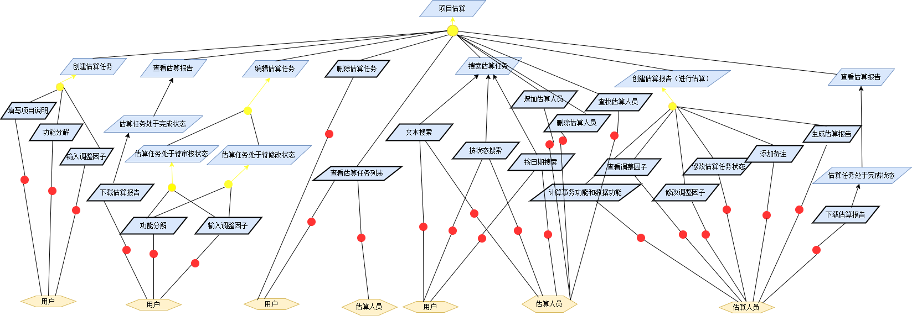
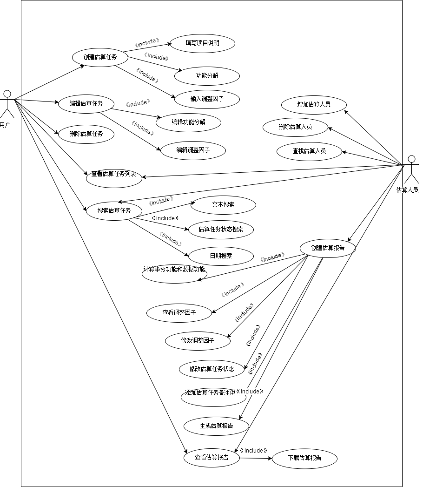
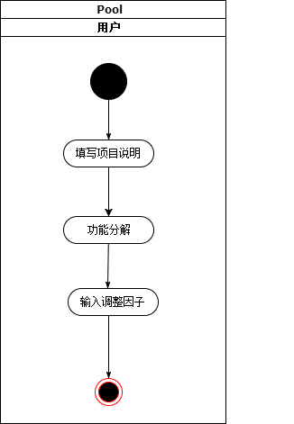
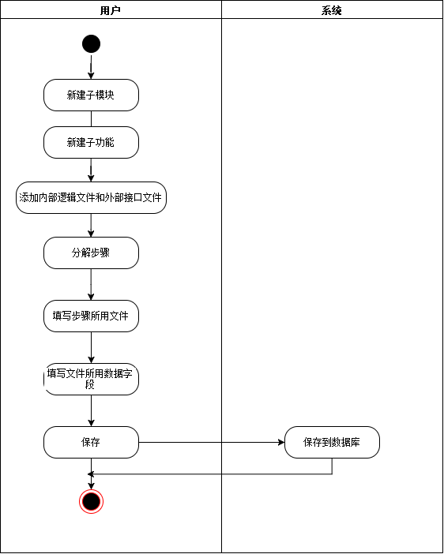
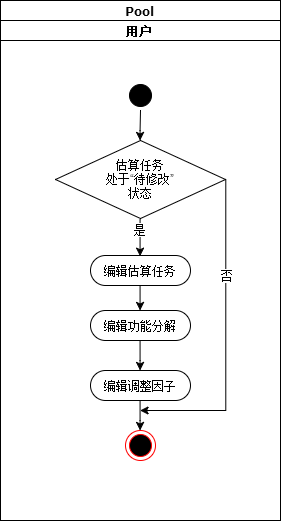
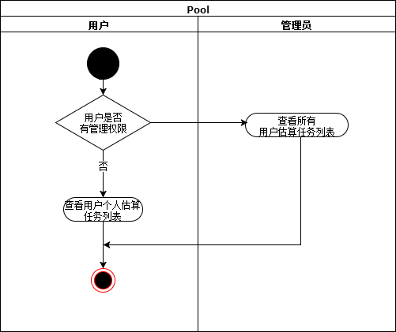
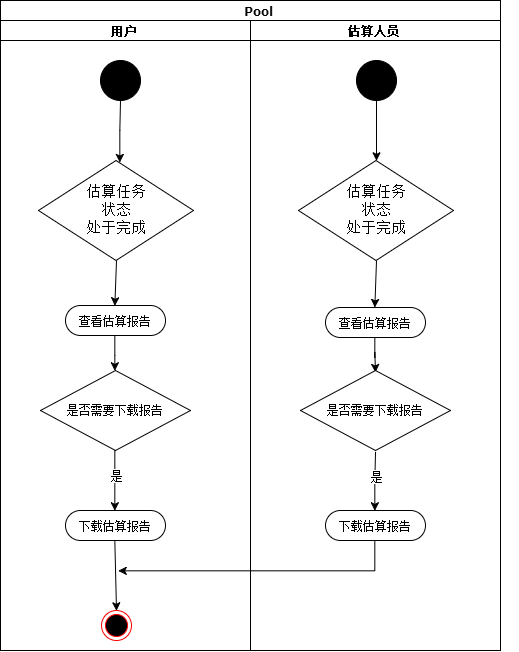

# 需求规约

## 项目介绍

- 背景

  ​	在软件行业发展早期，软件成本在软件开发中的受到的重视较少。随着计算机及软件行业发展，软件规模的扩大及复杂度的增加，软件在整个计算机系统中已经变成了开销最大的部分。然而，从上世纪六十年代开始，出现了以大量软件项目延期、预算超支和质量缺陷为典型特征的软件危机，时至今日仍频繁发生。

  ​	导致软件项目超支超时或者取消的原因有很多，其中，对软件成本的估算不足和需求不稳定是造成软件项目失控的最普遍的原因，而这会给软件开发者、用户和投资方三方都带来风险。越来越多产业界和学术界的人认识到，做好软件成本估算是减少项目预算超支问题的重要措施之一，科学合理的成本估算有助于确定预算和进度方面的参考里程碑，使得软件组织或管理者对软件开发过程进行监督，从而合理的控制和管理软件质量、人员生产率和产品进度。

  ​	而软件项目的成本估算一直以来较为复杂，由于软件本身的复杂性，估算人员经验的缺乏及人为错误、估算工具的缺乏等等多种原因，导致软件项目的成本估算和实际情况相差较远。软件估算也是软件开发中很重要的一个环节，如果低估项目周期会造成人力低估、成本预算低估、日程过短，最终人力资源耗尽，成本超出预算，为完成项目不得不赶工，影响项目质量，甚至导致项目失败。项目周期估计过长表面看来影响不大，但实际上也会带来成本估计过高，人力资源利用不充分效率低下的后果。无论哪种情况对于项目经理控制整个项目都会带来很大影响。成本估算是后续工作的基础，它完成质量的好坏所带来的影响会贯穿整个项目。

  ​	有效的估算是软件项目管理中最具挑战性也是最重要的活动。只有用科学的方法对软件项目的规模、工作量、进度与成本做出合理可信的估算，才能实施良好的项目计划与控制。软件开发成本估算已成为软件工程领域的一个重要研究方向，也是软件项目成功开发的一个重要组成环节。

- 目的

  ​	该软件成本估算平台将作为同济开源社区众包平台下的估算子模块，为广大开发者提供线上软件项目成本估算服务，这填补了国内线上软件成本估算平台的空白。项目发布人员发布项目时，可进入软件成本估算平台，通过参数的输入，对该项目进行软件成本估算，以方便准确地确定项目价格、工作量等。该平台旨在帮助项目发布人员准确进行软件项目成本估算、工作量估算，防止项目因软件成本估算的不足，而造成的软件项目失控。

- 目标群众

  ​	软件开发人员、软件项目投资方

- 项目边界

  ​	软件估算平台将使用IFPUG估算方法对软件项目进行估算

## 项目需求分析

## 用例分析

---

### 用例: _创建估算任务_

#### 标识符号

UC01

#### 说明

用户可以根据需求，创建项目的估算任务。

#### 参与者

用户、系统

#### 前置条件

用户已经登录。

#### 后置条件

该估算任务创建成功，估算任务状态设置为“待审核”。

#### 基本操作流程

1. 填写项目说明
2. 添加项目功能分解
3. 输入调整因子

------

### 用例: _填写项目说明_

#### 标识符号

UC02

#### 说明

用户可以根据项目，填写项目的说明。

#### 参与者

用户、系统

#### 前置条件

用户已经创建估算任务。

#### 后置条件

添加项目功能分解。

#### 基本操作流

1. 填写项目名称
2. 填写项目简介
3. 填写项目负责人
4. 填写联系方式
5. 填写估算方式

------

### 用例: _功能分解_

#### 标识符号

UC03

#### 说明

用户根据项目，对项目进行功能分解。

#### 参与者

估算人员、系统

#### 前置条件 

填写项目说明。

#### 后置条件

输入调整因子。

#### 基本操作流

1. 新建子模块

2. 新建子功能

3. 添加内部逻辑文件和外部接口文件

4. 分解步骤

5. 填写步骤所用文件

6. 填写文件所用数据字段

7. 保存

   

------

### 用例: _输入调整因子_

#### 标识符号

UC04

#### 说明

用户根据项目，填写项目的调整因子

#### 参与者

估算人员、系统

#### 前置条件

功能分解。

#### 后置条件

该估算任务创建成功，估算任务状态设置为“待审核”。

#### 基本操作流

1. 输入调整因子
2. 保存

------

### 用例: _编辑估算任务_

#### 标识符号

UC05

#### 说明

用户可以重新编辑估算任务请求。

#### 参与者

用户、系统

#### 前置条件 

用户已经登录，且选择某一估算状态为“待修改”的估算任务。

#### 后置条件

估算任务的状态修改为“待审核”

#### 基本操作流

1. 编辑功能分解

2. 编辑调整因子

   

------

### 用例: _编辑功能分解_

#### 标识符号

UC06

#### 说明

估算人员根据项目，填写项目的功能分解

#### 参与者

估算人员、系统

#### 前置条件

用户已经登录，且选择某一估算状态为“待修改”的估算任务

#### 后置条件

编辑调整因子

#### 基本操作流

1. 编辑子模块
2. 编辑子功能
3. 编辑内部逻辑文件和外部接口文件
4. 编辑步骤
5. 编辑步骤所用文件
6. 编辑文件所用数据字段
7. 保存

------

### 用例: _编辑调整因子_

#### 标识符号

UC07

#### 说明

估算人员根据项目，编辑项目的调整因子

#### 参与者

估算人员、系统

#### 前置条件

编辑功能分解

#### 后置条件

估算任务的状态修改为“待审核”

#### 基本操作流

1. 编辑调整因子
2. 保存

------

### 用例: _删除估算任务_

#### 标识符号

UC08

#### 说明

用户可以删除估算任务

#### 参与者

用户、系统

#### 前置条件

无

#### 后置条件

无

#### 基本操作流

1. 选中估算任务
2. 删除估算任务

------

### 用例: _查看估算任务列表_

#### 标识符号

UC09

#### 说明

用户可查看自己的估算任务列表、估算人员可查看所有估算任务列表

#### 参与者

用户、估算人员、系统

#### 前置条件

用户、估算人员已登录

#### 后置条件

无

#### 基本操作流

1. 查看估算任务列表

------

### 用例: _搜索估算任务_

#### 标识符号

UC10

#### 说明

可根据文本、估算任务状态、日期进行搜索

#### 参与者

用户、估算人员、系统

#### 前置条件

用户、估算人员已登录

#### 后置条件

无

#### 基本操作流

1. 选择搜索类型
2. 搜索

------

### 用例: _文本搜索_

#### 标识符号

UC11

#### 说明

根据文本进行模糊搜索

#### 参与者

用户、估算人员、系统

#### 前置条件

用户、估算人员已登录

#### 后置条件

无

#### 基本操作流

1. 在搜索类型中，选择文本
2. 输入对应内容

------

### 用例: _估算任务状态搜索_

#### 标识符号

UC12

#### 说明

根据估算任务状态进行搜索

#### 参与者

用户、估算人员、系统

#### 前置条件

用户、估算人员已登录

#### 后置条件

无

#### 基本操作流

1. 在搜索类型中，选择状态
2. 选择“待审核”、“待修改”、“已完成”其中的一个

------

### 用例: _日期搜索_

#### 标识符号

UC13

#### 说明

根据估算日期进行搜索

#### 参与者

用户、估算人员、系统

#### 前置条件

用户、估算人员已登录

#### 后置条件

无

#### 基本操作流

1. 在搜索类型中，选择日期
2. 选择日期

------

### 用例: _创建估算报告_

#### 标识符号

UC14

#### 说明

估算人员可对项目进行估算

#### 参与者

估算人员、系统

#### 前置条件

估算人员已登录，选择某一估算状态为“待审核”的估算任务

#### 后置条件

某一估算状态为“已完成”的估算任务

#### 基本操作流

1. 功能分解
2. 查看调整因子
3. 修改调整因子
4. 修改估算任务状态、添加估算任务备注说明
5. 生成估算报告

------

### 用例: _计算事务功能和数据功能_

#### 标识符号

UC15

#### 说明

根据用户填写的功能分解，进行事务功能、数据功能表格的填写

#### 参与者

估算人员、系统

#### 前置条件

估算人员修改某项目

#### 后置条件

查看调整因子

#### 基本操作流

1. 选择某模块
2. 填写事务功能表格
3. 填写数据功能表格
4. 保存

------

### 用例: _查看调整因子_

#### 标识符号

UC16

#### 说明

估算人员查看用户填写的调整因子

#### 参与者

估算人员、系统

#### 前置条件

估算人员功能分解

#### 后置条件

编辑调整因子

#### 基本操作流

1. 查看调整因子

------

### 用例: _修改调整因子_

#### 标识符号

UC17

#### 说明

估算人员修改用户填写的调整因子

#### 参与者

估算人员、系统

#### 前置条件

估算人员查看调整因子

#### 后置条件

修改估算任务状态

#### 基本操作流

1. 修改调整因子

------

### 用例: _修改估算任务状态_

#### 标识符号

UC18

#### 说明

估算人员修改估算任务状态

#### 参与者

估算人员、系统

#### 前置条件

估算人员修改调整因子

#### 后置条件

估算任务状态改为“待修改“或“已完成”

#### 基本操作流

1. 修改估算任务状态

------

### 用例: _添加估算任务备注说明_

#### 标识符号

UC19

#### 说明

估算人员修改估算任务备注说明

#### 参与者

估算人员、系统

#### 前置条件

修改估算任务状态

#### 后置条件

无

#### 基本操作流

1. 修改估算任务备注说明

------

### 用例: _生成估算报告_

#### 标识符号

UC20

#### 说明

估算人员生成估算报告

#### 参与者

估算人员、系统

#### 前置条件

估算任务状态为“已完成”

#### 后置条件

无

#### 基本操作流

1. 生成估算报告

------

### 用例: _查看估算报告_

#### 标识符号

UC21

#### 说明

用户、估算人员均可查看估算报告。

#### 参与者

用户、估算人员

#### 前置条件 

用户、估算人员已经登录，且选择某一估算状态为“已完成”的估算任务。

#### 后置条件

1. 查看估算报告

2. 如需要，可下载估算报告

   

------

### 用例: _下载估算报告_

#### 标识符号

UC22

#### 说明

可以下载生成的估算报告

#### 参与者

估算人员、用户

#### 前置条件

估算任务状态为“已完成”

#### 后置条件

无

#### 基本操作流

1. 点击“导出”，下载估算报告

------

### 用例: _增加估算人员_

#### 标识符号

UC23

#### 说明

管理员可以增加估算人员

#### 参与者

管理员、系统

#### 前置条件

管理员登录系统

#### 后置条件

无

#### 基本操作流

1. 增加估算人员

------

### 用例: _查找估算人员_

#### 标识符号

UC24

#### 说明

管理员可以查找估算人员

#### 参与者

管理员、系统

#### 前置条件

管理员登录系统

#### 后置条件

无

#### 基本操作流

1. 查找估算人员

------

### 用例: _删除估算人员_

#### 标识符号

UC25

#### 说明

管理员可以增加估算人员

#### 参与者

管理员、系统

#### 前置条件

管理员登录系统

#### 后置条件

无

#### 基本操作流

1. 删除估算人员

------
